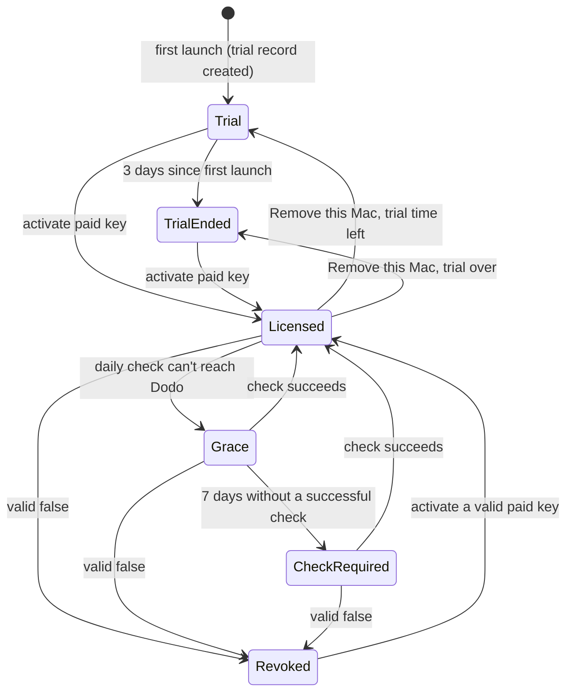

# Licensing

How every OpenApps HQ app sells and checks licenses. OpenKlack and OpenReaction follow this document, and any new app under `apps/` must too. If an app needs to differ, change this document first.

## Principles

- **The source is free.** Apps are MIT licensed. A build from source has licensing compiled out: every feature works and nothing contacts the license service.
- **The license pays for the official build**: the signed build installed with Homebrew, with updates. Release and update rules are in [RELEASES.md](RELEASES.md).
- **No license server.** Apps talk directly to Dodo Payments' public license endpoints. There are no secrets in any app. The only OpenApps backend is a tiny **trial registry** that remembers when each Mac started each app's trial.
- **No signup to try.** The official build works right after download and stops by itself after 3 days. Only buying goes through checkout.
- **Privacy first.** License checks send only the license key and an activation ID. The trial registry receives only a one-way hash of the Mac's hardware ID, salted per app, so it can't be linked across apps or back to the Mac. Never the Mac's name, user, raw hardware IDs, typed content or usage.

## Commercial terms

| Term | Value |
| --- | --- |
| Price | $5 per app, one-time, with purchasing power parity (checkout lowers the price by the buyer's country) |
| Updates | Lifetime |
| Devices | 3 Macs per license |
| Trial | 3 days per Mac from the first launch of the official build, in the app, no signup |
| License check | **Daily**, every 24 hours |
| Offline grace | 1 week since the last successful check |
| Payment provider | [Dodo Payments](https://dodopayments.com), one brand per app |

The daily check always runs. The 1-week grace only covers a Mac that is offline or can't reach Dodo, so a laptop that is away from the internet for a few days keeps working.

## Dodo Payments setup

One business (OpenApps) with **one brand per app**, so checkout, card statements and emails show the app's name and logo.

| App | Brand ID | Statement descriptor |
| --- | --- | --- |
| OpenKlack | `brnd_0Nnask8u9RICKzhm6lKrS` | `DODOPAY_OPENKLACK` |
| OpenReaction | `brnd_0NnarnziynbFJozfJUS5T` | `DODOPAY_OPENREACTION` |

Each app has **one product** under its brand, created in test mode first and copied to live:

| Product | Price | License key entitlement |
| --- | --- | --- |
| `<App>` | $5 one-time, purchasing power parity on | License keys on, activation limit 3, never expires |

There is no trial product: the trial lives in the app. Refunding the product disables its key automatically. Product IDs are public configuration compiled into official builds and set in the website's environment.

**Check the product after every change** (`GET /products/{id}`): `license_key_enabled` must be `true` with `license_key_activations_limit: 3` and no `license_key_duration`, and `price.purchasing_power_parity` must be `true`. A product without license keys takes payments and issues nothing.

## Endpoints

All public, no API key. Release builds use `https://live.dodopayments.com`; development builds use `https://test.dodopayments.com`.

| Call | Request body | Success |
| --- | --- | --- |
| Activate | `POST /licenses/activate` `{license_key, name}` | `201` `{id, product: {product_id, name}, created_at, …}` |
| Validate | `POST /licenses/validate` `{license_key, license_key_instance_id}` | `200` `{valid}` |
| Deactivate | `POST /licenses/deactivate` `{license_key, license_key_instance_id}` | `200` |

- The activation `name` is always the literal string `"Mac"`.
- Activation is the only response that says which product a key belongs to. Validation returns only `valid`.

| Response | Meaning |
| --- | --- |
| Activate `404` | Key not found |
| Activate `403` | Key disabled or expired |
| Activate `422` | All 3 Macs already activated |
| `429` | Rate limited: honor `Retry-After`, treat as offline |
| `5xx`, timeout, no network | Offline: grace rules apply, state never gets worse |
| Validate `{valid: false}` | Authoritative: refunded, disabled, or this Mac was removed |

## States

| State | Core feature | What the user sees |
| --- | --- | --- |
| Trial | On | "Free trial: N days left", Buy a license, key field |
| TrialEnded | Off | "Your free trial has ended", Buy a license, key field |
| Licensed | On | "Licensed", Remove this Mac |
| Grace | On | Nothing for the first 5 days offline, then "Connect to the internet within N days to keep using <App>" |
| CheckRequired | Off | "Connect to the internet to verify your license", Try again |
| Revoked | Off | "This license is no longer active on this Mac", Activate again, Buy, Contact support |

The apps never show a price: the buy button says "Buy a license" and opens the website, the single place for pricing and offers.

A license always wins over the trial: while a license record exists, the app is in a license state, and the trial record is ignored (but kept).

"Off" stops only the app's core feature (sounds, the emoji picker). The menu bar, Settings, License and Quit always work. Licensing never crashes the app, deletes settings or blocks quitting. When the trial ends, the app says so once (a notification or the menu bar item) and opens nothing on its own.

## Rules

### Activation and the product check
1. Call activate. On success, read `product.product_id`.
2. If it matches the app's paid product for the current environment, the key is **paid**.
3. Anything else (another app's key, the wrong environment, a retired trial product) is refused:
   - immediately deactivate the new activation, so the customer's slot isn't used up;
   - store nothing;
   - show "This key is for <product name>, not <App>".
4. Bundles and discounts: a bundle is one checkout containing several apps' paid products plus a discount code (percentage varies by offer, restricted to the included products). Each app receives its own key for its own product, so apps need no bundle awareness and the product check stays {paid} per app.

### Stored records
Two records per app, in the app's encrypted record store (below), never in plain preferences and never in the Keychain:

**License record**, file `license`:

| Field | Source |
| --- | --- |
| `license_key` | What the user entered |
| `instance_id` | Activation `id` |
| `product_id` | Activation response and the product check |
| `activated_at` | Activation `created_at` (server time) |
| `last_success_at` | Time of the last `valid: true`, from the response `Date` header, falling back to the local clock |
| `last_observed_at` | The latest trustworthy time the app has seen. Local-clock observations on each scheduler tick only raise it; a successful check sets it to the server `Date`, even if that is lower, so a local clock that had run ahead doesn't leave the record permanently untrusted |
| `revoked` | Set when Dodo answers `valid: false` for this activation; cleared only by `valid: true` for the same activation or a new activation |
| `pending_cleanups` | Activations the app still owes a deactivation for (replaced, refused or abandoned); kept even with no record |

**Trial record**, file `trial`:

| Field | Source |
| --- | --- |
| `started_at` | Trial start on the local clock: the registry's start converted to local time, or the local clock at a provisional start |
| `last_seen_at` | Highest local clock value the app has observed while the trial record exists; only ever raised |
| `registered` | `true` once the trial registry has answered for this Mac; a provisional trial is `false` |

The trial record is never deleted by the app: not by Remove this Mac, not by activating or losing a license. If it's deleted anyway (the store directory removed, a reinstall on a wiped account), the app asks the trial registry again and gets the original start back.

### Record store
Decided 2026-09-16: the apps store no records in the Keychain. Without an Apple Developer identity the apps are signed by a self-signed certificate, and a Keychain item's access list is tied to the signing identity; any identity change (a rebuilt certificate, a development build over a release install) makes macOS ask the user for the app's own records on every launch. A file the app owns never prompts.

- **Where:** `~/Library/Application Support/OpenApps/<app id>/records/`, directory mode `0700`, one file per record (`license`, `trial`), mode `0600`. Written atomically: temporary file in the same directory, `fsync`, rename over the old file.
- **Format:** `openapps-records-v1` magic, a 12-byte random nonce, then AES-256-GCM over the record's JSON with `<app id>:<file name>` as additional authenticated data, then the 16-byte tag. A third file, `cleanups`, holds the owed deactivations in the same format; an empty list deletes it. The key is 32 bytes of HKDF-SHA256, no salt, `info = "openapps-records-v1:<app id>"`, over the UTF-8 bytes of the Mac's IOPlatformUUID; when the UUID can't be read, of the fixed string `no-hardware-uuid`. Nothing about the key is stored.
- **What this protects:** casual reading and editing of the files, and copying them to another Mac (a different UUID can't open them). Not a determined local user: the source is public, so the key can be derived. That is the same limit the design already accepts (a patched app skips every check).
- **Read outcomes** map onto the existing storage semantics: no file is *positively absent* (nil); a directory or file that can't be read is *unavailable*; a file that fails the magic, the authentication tag or JSON decoding is *corrupt*. Unavailable and corrupt are storage errors: no new trial, no registry call, nothing overwritten (shared case 17). A corrupt or foreign trial file is left in place and reported, never replaced by a fresh trial.
- **Deletion:** `Remove this Mac` deletes `license`; nothing ever deletes `trial`. Removing the directory by hand is the "records deleted" case: the registry restores the trial start and a license key has to be entered again.
- **Symlinks:** record files and the records directory are opened without following symlinks. Absent means no directory entry at all; a symlink or a non-regular file is unavailable, never absent, and is never replaced.
- **Indeterminate saves:** the rename over the old file commits the record; only the directory sync can fail after it. That failure is reported as *indeterminate* (possibly committed, not yet durable), not as a failed save: the app keeps the new record and state in memory as if saved, never deactivates the new activation or restores the old record, shows the storage error, and re-saves the same record on every tick until a save succeeds. A grant still waits for that success. A delete whose directory sync fails is retried the same way.
- **Old Keychain items** from releases before 0.1.2 are ignored and never read, written or deleted: touching them is what prompts. They stay orphaned in the login keychain.
- **Journal:** unchanged; it lives beside the records (user defaults or a plain file in the same support directory) and is not encrypted, since it holds no secret.

### Trial registry
The one OpenApps backend. It remembers when each Mac started each app's trial, so deleting the records or reinstalling can't restart it. It knows nothing about licenses, purchases or people.

- **Where:** `POST https://openapps.space/api/trial`, a Cloudflare Worker in front of a Cloudflare D1 table. Development builds use the same endpoint with `env: "test"`, which is stored separately.
- **Request:** `{"app": "<app id>", "device": "<device hash>", "env": "live" | "test"}`. Nothing else: no key, no email, no version, no locale.
- **Device hash:** lowercase hex SHA-256 of `openapps-trial-v1:<app id>:<IOPlatformUUID>`. The app id salts it, so one Mac's hashes for two apps don't match, and the raw hardware UUID never leaves the Mac. If the hardware UUID can't be read, the app uses a random UUID saved in the trial record (weaker, but never blocks the trial).
- **Response:** `200 {"started_at": "<ISO 8601>", "now": "<ISO 8601>"}`. The first request for an (app, env, device) stores `started_at = now`; every later request returns the stored value unchanged. The registry never moves a start later or earlier.
- **Errors:** `400` malformed request, `429` rate limited (honor `Retry-After`), anything else or no answer counts as offline. The registry never answers with a trial state; the app computes that.
- **Storage:** one row per (app, env, device): `started_at` and `created_at`. No IP addresses, user agents or logs of requests are stored.
- **Abuse limits:** per-IP rate limiting at the Worker. A hash that doesn't match the format is rejected. Someone who scripts fake hashes gains nothing, since every hash only starts its own trial.
- **Limits of the design:** a patched app skips every check, and a Mac whose hardware UUID changes (logic board replacement) gets a new trial. Both are accepted.

**Write order:** a change that removes access (revocation, trial end) takes effect in memory immediately, then is saved; a failed save is retried on every tick and shown as a storage error. A change that grants access is saved first and only then takes effect. Starting the trial grants access, so the trial record is saved before the core feature turns on.

**Revocation journal:** so a revocation survives a failed record save followed by a restart, each app also keeps a small non-secret journal outside the record store (user defaults or a plain file in its support directory), keyed by a SHA-256 hash of the activation ID, holding only the revocation time. It's written before the record save. On load, a journal entry for the stored activation forces Revoked regardless of the stored record. The entry is cleared only when the revoked record is saved, on `valid: true` for that activation, or once a replacement or removal of that activation has been **durably** saved or deleted in the record store. Until then it stays as a tombstone that keeps the core off after a restart, and the pending delete or replace is retried. Journal writes and clears report success: if recording fails, the app still locks in memory and shows a storage error. **Never compare clocks to decide staleness.** The stored record carries a durable `event_seq` counter, incremented on every authoritative change (activation, `valid: true`, revocation, removal). A journal entry stores the `event_seq` of its revocation or tombstone, not a time. On load the entry is honored only if its sequence is greater than the stored record's `event_seq` (the saved record hasn't caught up yet); otherwise it's stale and dropped. **Journal operations are conditional on the sequence.** A clear removes an entry only if the entry's sequence is at or below the sequence being cleared, and recording a revocation writes only if its sequence is greater than the existing entry's. Pending retries are merged per activation, so a newer operation always supersedes older ones and a delayed retry can never delete or overwrite a newer revocation. "Newer" means queued later: each pending operation carries its own increasing operation counter. Its scope (the sequence it clears up to) never decides priority, and no sentinel value such as "clear everything" may outrank a later revocation. A replacement may clear a *different, earlier* activation's entry completely, but only after the new record has been saved.

**Recovering from an unreadable journal.** A missing journal counts as empty. An unreadable or corrupt journal is a storage error and the core stays off, but the app must not strand the user:
- keep the successfully read record as a recovery candidate, and scope the "journal unreadable" restriction to that activation, so a saved grant for a new activation retires it;
- immediately run an authoritative check for it;
- `valid: true` rebuilds the journal and unlocks;
- `valid: false` rebuilds the journal with the revocation recorded;
- in both cases the rebuild **never removes the unreadable data first**: write the new journal (a temporary file atomically moved into place, or a new versioned key), read it back to verify, and only then retire or set aside the unreadable data, so a failure at any step leaves the Mac locked;
- offline, the core stays off and the check retries;
- Settings → License shows the storage error with a "Try again" that forces the check.

The corrupt journal is never overwritten before a replacement has been written. The journal never contains the license key.

**Unreadable storage:** if the license record, the trial record or `pending_cleanups` can't be read, the app shows a storage error and retries; it never treats unreadable storage as "no license" or "no trial yet", never starts a new trial over a record it couldn't read, and never overwrites entries it couldn't read. Only a read that positively reports "item not found" counts as absent.

### Daily check
- **When:**
  - on launch, in the background, never delaying launch or the core feature;
  - every 24 hours while the app runs;
  - on wake from sleep and when the network comes back, if the last check is older than 24 hours.
- **Only licensed Macs check.** A Mac with no license record makes no Dodo calls; its only network call is the trial registry, and only while its trial is unregistered.
- **Activation counts as a successful check.**
- **One check at a time.** Failed checks retry with backoff from 1 minute up to 1 hour, then fall back to the daily schedule.
- **Schedule on the local clock.** Keep a local `next_attempt_at`: any answer from Dodo (valid or not) or an activation sets it to now + 24 hours; a failure sets it by the backoff. Never compare server timestamps with the local clock to decide when to check, so a Mac whose clock runs ahead or behind still checks once a day.
- **Deadlines don't wait on I/O.** Trial expiry, the end of grace and a detected clock rollback switch the core feature off on time, from a timer that only reads the in-memory state. They never wait for a record save, a network call or a cleanup to finish.

### Offline grace (paid licenses)
- **Grace:** the core feature stays on while `now − last_success_at` is at most 7 days.
- **After 7 days** without a successful check: CheckRequired until a check succeeds.
- **Clock rollback:** if the local clock is more than 1 hour earlier than `last_observed_at`, don't extend grace; require a check (CheckRequired) until a successful check re-anchors time from the server `Date`.
- **Only an answer from Dodo revokes:** a network failure never revokes a license. Only `valid: false` does.

### Trial
- **Starting:** on launch of an official build with no license record, if the trial record is positively absent, create a provisional one (`started_at = last_seen_at = now`, `registered = false`), save it, turn the core feature on, and ask the registry in the background. No button, no prompt, and launch never waits for the network. If the save fails, show a storage error, keep the core off and retry; don't run an unsaved trial.
- **Registering:** while `registered` is `false`, ask the registry on launch, on every scheduler tick with backoff (1 minute up to 1 hour, honoring `Retry-After`), on wake and when the network comes back. On an answer, convert the registry's start to local time (`local_now − (registry_now − registry_started_at)`), keep the **earlier** of that and the provisional start, set `registered = true` and save. Registration follows the write order: if it extends access (the 24-hour offline limit no longer applies, or the trial is back on), save first and extend only once the save succeeds, keeping the provisional limit in memory until then. If it restricts access (an earlier start shortens or ends the trial), apply it in memory first, then save. A registered trial never contacts the registry again.
- **Fallback device ID:** when the hardware UUID can't be read, the random fallback ID must be saved in the trial record before **every** registry request that uses it, so the registry never sees an ID that a restart could lose.
- **Offline limit:** an unregistered trial runs for at most 24 hours of elapsed time. After that the core turns off with "Connect to the internet to continue your free trial" until the registry answers; the answer then decides how much trial is left. This stops a Mac that blocks the registry from getting a fresh trial after every deletion of the records.
- **Elapsed time never goes backwards:** `elapsed = last_seen_at − started_at`, where `last_seen_at` only ever rises. Setting the clock back can't add trial time. A clock set far ahead and then corrected ends the trial early; that's accepted.
- **Elapsed time never stops while the app runs:** on every tick, `last_seen_at = max(last_seen_at + monotonic time since the previous tick, now)`, using a monotonic clock that keeps counting through sleep (for example `mach_continuous_time`). A wall clock that's frozen or set back therefore doesn't pause the trial. Keep one trial clock with an anchor `(wall time, monotonic time, last_seen_at)` and a single observe step that advances `last_seen_at` **exactly once** per observation and then re-anchors. Every consumer goes through it: ticks, wake, snapshots, the deadline timer and applying the registry answer. A save failure never moves the anchor. Each observation samples wall and monotonic time inside the serialized section, after any lock wait or I/O that comes before it, never before. An observation whose monotonic time is older than the anchor's is ignored without changing anything, so the anchor only moves forward. Access and deadlines are computed from the monotonically projected `last_seen_at`, not from the stored wall time, and on wake the restriction is observed and applied before any I/O.
- **Clock behind at launch or wake:** if `now` is more than 1 hour earlier than `last_seen_at` when the app launches or wakes, and there's no license record, the core turns off with "Your Mac's clock is behind. Set the correct date and time to keep using your free trial" until `now` is within 1 hour of `last_seen_at` again. The trial isn't ended and no time is added. While the clock is behind, **every trial write is frozen**: no trial saves, no change to the start or `last_seen_at`, and no registry answer applied. A registry answer that arrives meanwhile is kept in memory as raw `started_at` and `now` values, and converted and applied only once the clock is back within the hour. Leaving the "clock behind" state is a grant, so it happens only through a fresh observe step that re-establishes the monotonic anchor. A held or cached state still marked "behind" may restrict, but never unlocks, even if the wall clock already looks correct and storage or the network is still busy. This closes the gap where a Mac kept at a past date would never reach the trial end across restarts.
- **Ending:** the trial ends when `elapsed` reaches 3 days. The deadline timer switches the core off on time from memory (see "Deadlines don't wait on I/O").
- **Keeping `last_seen_at`:** raise it in memory on every scheduler tick and on wake; save it at most once an hour, when the trial ends, and on quit. A failed save is retried and never blocks the core feature or the trial deadline.
- **Remaining time shown:** "N days left", rounded up, from `3 days − elapsed`; "less than a day left" in the final 24 hours.
- **Buying during a trial:** activating a paid key makes the Mac Licensed. The trial record is kept, and nothing needs deactivating.
- **Removing a license:** after Remove this Mac (or if the license record is removed), the app returns to Trial if trial time is left, otherwise TrialEnded. Removing a license never restarts or extends the trial.

### Owed deactivations
- **Replacing or refusing an activation** (a different paid key, a key for another app, a record that couldn't be saved) always deactivates the unwanted activation, so the customer's slot isn't used up.
- **If Dodo can't be reached**, the activation is stored in `pending_cleanups` and retried on the scheduler (every 5 minutes while any are owed, honoring `Retry-After`), across restarts, until Dodo confirms.

### Removing a Mac
- **From Settings:** Settings → License → Remove this Mac deactivates, then clears the license record. The trial record stays.
- **Offline:** if deactivation can't reach Dodo, keep the record and ask the user to try again online.
- **Lost or dead Mac:** the customer emails support, and support removes the activation in the Dodo dashboard.

## Build flavours

| Build | Licensing | Talks to |
| --- | --- | --- |
| From source (default) | Off: no License UI, no trial, no license network calls, all features on | Nothing |
| Official development build | On | Dodo test mode, test product ID; trial registry with `env: "test"` |
| Official release build (CI) | On | Dodo live mode, live product ID; trial registry with `env: "live"` |

| Stack | How licensing is switched on |
| --- | --- |
| Swift apps | Compile condition `OPENAPPS_LICENSING` plus generated config (host and paid product ID) from the release script |
| Tauri / Rust apps | Cargo feature `licensing` plus build-time environment for host and paid product ID |

## Website and checkout

- **Buttons on each app page:** an install block with the exact `brew install --cask <cask>` command and a Copy button (the page says it includes a 3-day trial, no signup), and "Buy for $5" (checkout link). An app is available exactly when its paid product ID and its Homebrew cask are configured; otherwise both show "Coming soon". Pulling an app from sale means unsetting its cask variable. There is no code-side on/off list.
- **Hosting:** the website and the trial registry are one Cloudflare Worker: static assets for the pages, `/api/trial` backed by D1. Cloudflare's free plan allows commercial use; Vercel's Hobby plan doesn't.
- **Configuration:** the website reads the checkout origin (`VITE_DODO_CHECKOUT_ORIGIN`), each app's paid product ID (`VITE_<APP>_DODO_PAID_PRODUCT_ID`) and each app's Homebrew cask (`VITE_<APP>_BREW_CASK`, `owner/tap/name`) from build-time environment variables; an optional `VITE_<APP>_MAC_DOWNLOAD_URL` adds a direct download beside the brew command and never gates availability on its own. Production uses live values from the `website-live` GitHub environment; local development uses Dodo test mode.
- **Return URL:** checkout returns to `/<app>/thanks/`, and Dodo appends `license_key` and `email`.
- **Thanks page:**
  - shows the key with Copy, an "Open <App>" deep link (`<app>://activate?key=…`) and setup steps, including a download link for buyers who haven't installed the app yet;
  - removes the query string from the address bar immediately;
  - never logs, stores or sends the key;
  - is `noindex`;
  - is on the site's known-pages list.
- **Deep link:** it only pre-fills the key field. The user confirms before activating.
- **Bundles and discounts:** static `/buy/{product_id}` links are single-product. A cart with several apps' paid products and a discount code needs a Dodo checkout session (`POST /checkouts` with `product_cart` and `discount_codes`), which requires the secret API key, so bundles get a tiny serverless endpoint when they ship (not now). Dodo returns the keys comma-separated in `license_key` without saying which app each belongs to: the thanks page lists all keys and tells the user to paste each into its app; an app's product check rejects a key for another app without using up a slot.

## Privacy copy

Every licensed app ships this text, adapted with its name, in the README, the website FAQ and the About/License screen:

> Official builds include a 3-day free trial with no signup. To keep it to one trial per Mac, the app sends a one-way hash of your Mac's hardware ID (it can't be turned back into the ID or linked across our apps) to our trial registry once, when the trial starts. If you buy a license, the app checks it with Dodo Payments, our payment provider: the license key and an activation ID are sent when you activate and once a day after that. Your Mac's name, what you type, and how you use the app are never sent. Builds from source never contact the license service.

## Shared test cases

Every app implements these against a fake Dodo client, a fake record store and an injectable clock. `P` = this app's paid product, `X` = another app's product. "Fresh Mac" means no license record and a trial record that is positively absent.

| # | Given | When | Then |
| --- | --- | --- | --- |
| 1 | Trial or TrialEnded | activate → `201` product `P` | Licensed; license record saved |
| 2 | Trial or TrialEnded | activate → `201` product `X` | New activation deactivated; nothing saved; "key is for …" |
| 3 | TrialEnded | activate → `422` | TrialEnded; "all 3 Macs already activated" |
| 4 | TrialEnded | activate → `404` / `403` | TrialEnded; "key not found" / "key disabled or expired" |
| 5 | TrialEnded | activate → timeout | TrialEnded; "couldn't reach the license service"; nothing saved |
| 6 | Licensed, last success 25 h ago | app running | Daily check runs |
| 7 | Licensed, last success 2 days ago | check → timeout | Grace; core feature on |
| 8 | Licensed, last success 8 days ago | check → timeout | CheckRequired; core feature off |
| 9 | CheckRequired | check → `valid: true` | Licensed; `last_success_at` updated |
| 10 | Licensed | check → `valid: false` | Revoked; core feature off |
| 11 | Licensed, last success 3 days ago | local clock 2 days before `last_success_at` | Check required; grace not extended |
| 12 | Fresh Mac | launch; registry → new start | Provisional record saved, core on before the answer; then registered with 3 days left |
| 13 | Registered trial started 3 days + 1 min ago | launch (offline or online) | TrialEnded; core off; no network calls |
| 14 | Registered trial, 2 days elapsed | clock set back 5 days, relaunch | Core off with "clock is behind"; nothing saved; once the clock is corrected, Trial with 1 day left |
| 15 | Trial, 2 days 23 h 59 min elapsed | app keeps running 2 min | Core switches off on time without waiting for any save or network call |
| 16 | Fresh Mac, trial record save fails | launch | Storage error; core off; retried; no trial running |
| 17 | Trial record unreadable (not "not found") | launch | Storage error; core off; no new trial created; registry not called; existing data not overwritten |
| 18 | Records deleted, registry has a start 4 days ago | launch | Provisional trial, then the registry answer ends it: TrialEnded |
| 19 | Records deleted, registry has a start 1 day ago | launch | Trial with 2 days left, not 3 |
| 20 | Fresh Mac, registry unreachable | 23 h, then 25 h of elapsed time | Trial on at 23 h; at 24 h core off with "connect to continue"; registry answer then restores the right remaining time |
| 21 | Registry → `429 Retry-After: 120` or `500` | tick | No registry call for 120 s / backoff; state unchanged |
| 22 | Licensed, trial ended earlier | Remove this Mac → `200` | TrialEnded; license record cleared; trial record unchanged |
| 23 | Licensed, 1 day of trial left | Remove this Mac → `200` | Trial with 1 day left |
| 24 | Licensed | Remove this Mac → timeout | Still Licensed; retry message |
| 25 | Any | Dodo `429` with `Retry-After: 60` | No Dodo call for 60 s; state unchanged |
| 26 | Source build | launch | No License UI, no trial, no registry or license calls, core feature on |
| 27 | Same Mac, two apps | compute device hashes | Different hashes; neither equals the raw hardware UUID |
| 28 | Trial, 1 day elapsed, app running | wall clock frozen (or set back) while 2 days of monotonic time pass | TrialEnded on time; elapsed advanced by the monotonic time |
| 29 | Unregistered trial at 23 h | registry answers, then the save blocks past 24 h | Core off at 24 h; back on only after the save succeeds |
| 30 | Fallback device ID, record saves failing | registry tick | No registry request until the fallback ID is saved |
| 31 | The store holds a license record from the old trial keys (`kind: trial` or a non-paid product) | launch | Not a license; the trial rules apply |

## Adding licensing to a new app

1. Create the app's brand in Dodo: name, logo, website, statement descriptor.
2. Create the `<App>` product under that brand ($5, purchasing power parity, license keys on, 3 activations, no expiry), in test mode, then copy to live. Read it back with `GET /products/{id}` and confirm those settings.
3. Implement the states, rules and test cases above behind the app's licensing build flag.
4. Add the product ID and host to the app's official build configuration and the website's environment.
5. Add the License screen, the privacy copy, and the website's download, buy and thanks pages.
6. Run the shared test cases, then verify end to end in Dodo test mode:
   - a fresh install runs the trial and stops after 3 days (with a shortened trial length in a debug build);
   - a test checkout issues and emails a key, and the thanks page shows it;
   - that key activates on 3 Macs and the 4th is refused;
   - a refund revokes;
   - Remove this Mac frees a slot.

## Still to verify in Dodo test mode

Verified so far: activating an unknown key answers `404 NOT_FOUND`; validating an unknown key answers `200 {"valid": false}`; deactivating an unknown instance answers `404`.

- [ ] A test checkout of the paid product issues and emails a key, and returns it on the redirect.
- [ ] Activation error codes for limit reached and disabled key.
- [ ] Validation returns `false` for an activation removed in the dashboard.
- [ ] A refund makes validation return `false`.
- [ ] Emails and invoices show the app's brand.
