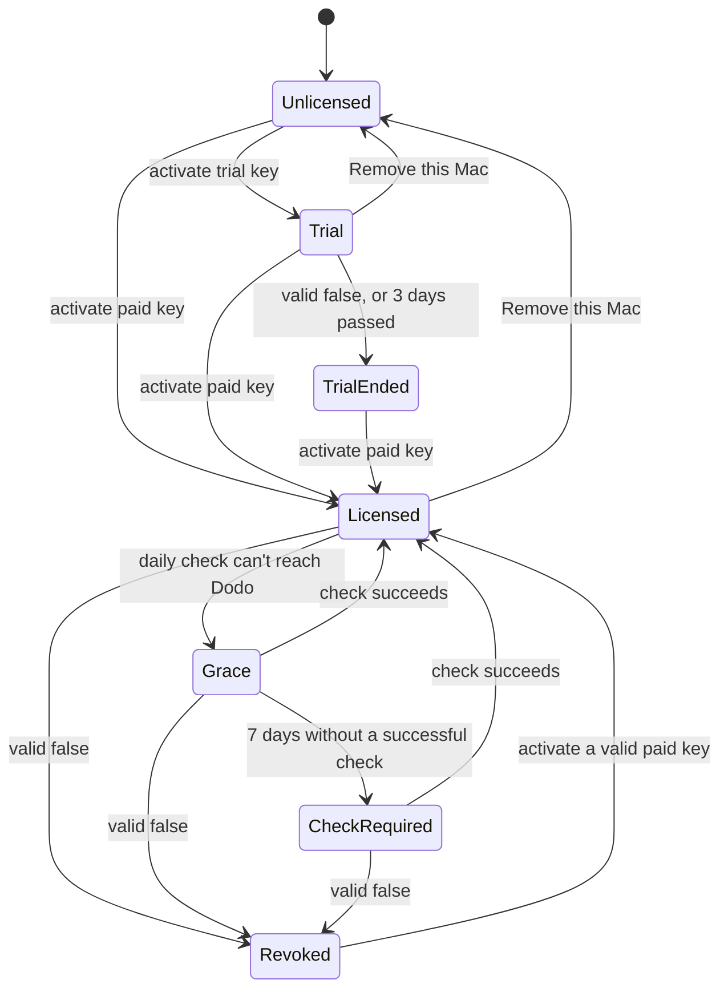

# Licensing

How every OpenApps HQ app sells and checks licenses. OpenKlack and OpenReaction follow this document, and any new app under `apps/` must too. If an app needs to differ, change this document first.

## Principles

- **The source is free.** Apps are MIT licensed. A build from source has licensing compiled out: every feature works and nothing contacts the license service.
- **The license pays for the official build**: the signed, notarized download with updates.
- **No license server.** Apps talk directly to Dodo Payments' public license endpoints. There are no secrets in any app.
- **Privacy first.** License checks send only the license key and an activation ID. Never the Mac's name, user, hardware IDs, typed content or usage.

## Commercial terms

| Term | Value |
| --- | --- |
| Price | $5 per app, one-time |
| Updates | Lifetime |
| Devices | 3 Macs per license |
| Trial | 3 days, through a free trial license key, 1 Mac |
| License check | **Daily**, every 24 hours |
| Offline grace | 1 week since the last successful check |
| Payment provider | [Dodo Payments](https://dodopayments.com), one brand per app |

The daily check always runs. The 1-week grace only covers a Mac that is offline or can't reach Dodo, so a laptop that is away from the internet for a few days keeps working.

## Dodo Payments setup

One business (OpenApps) with **one brand per app**, so checkout, card statements and emails show the app's name and logo.

| App | Brand ID | Statement descriptor |
| --- | --- | --- |
| OpenKlack | `brnd_0Nnask8u9RICKzhm6lKrS` | `DODOPAY_OPENKLACK` |
| OpenReaction | `brnd_0NnarnziynbFJozfJUS5T` | `DODOPAY_OPENREACTION` |

Each app has two products under its brand, created in test mode first and copied to live:

| Product | Price | License key entitlement |
| --- | --- | --- |
| `<App>` | $5 one-time | Activation limit 3, never expires |
| `<App> Trial` | $0 one-time | Activation limit 1, expires after 3 days |

Refunding the paid product disables its key automatically. Product IDs are public configuration compiled into official builds.

## Endpoints

All public, no API key. Release builds use `https://live.dodopayments.com`; development builds use `https://test.dodopayments.com`.

| Call | Request body | Success |
| --- | --- | --- |
| Activate | `POST /licenses/activate` `{license_key, name}` | `201` `{id, product: {product_id, name}, created_at, …}` |
| Validate | `POST /licenses/validate` `{license_key, license_key_instance_id}` | `200` `{valid}` |
| Deactivate | `POST /licenses/deactivate` `{license_key, license_key_instance_id}` | `200` |

- The activation `name` is always the literal string `"Mac"`.
- Activation is the only response that says which product a key belongs to. Validation returns only `valid`.

| Response | Meaning |
| --- | --- |
| Activate `404` | Key not found |
| Activate `403` | Key disabled or expired |
| Activate `422` | All 3 Macs already activated |
| `429` | Rate limited: honor `Retry-After`, treat as offline |
| `5xx`, timeout, no network | Offline: grace rules apply, state never gets worse |
| Validate `{valid: false}` | Authoritative: refunded, disabled, expired, or this Mac was removed |

## States

| State | Core feature | What the user sees |
| --- | --- | --- |
| Unlicensed | Off | Settings → License: Start 3-day trial, Buy for $5, key field |
| Trial | On | "Trial: about N days left", Buy for $5 |
| TrialEnded | Off | "Your trial has ended", Buy for $5, key field |
| Licensed | On | "Licensed", Remove this Mac |
| Grace | On | Nothing for the first 5 days offline, then "Connect to the internet within N days to keep using <App>" |
| CheckRequired | Off | "Connect to the internet to verify your license", Try again |
| Revoked | Off | "This license is no longer active on this Mac", Activate again, Buy, Contact support |

"Off" stops only the app's core feature (sounds, the emoji picker). The menu bar, Settings, License and Quit always work. Licensing never crashes the app, deletes settings or blocks quitting.

## Rules

### Activation and the product check
1. Call activate. On success, read `product.product_id`.
2. If it matches the app's paid product for the current environment, the key is **paid**. If it matches the trial product, it's **trial**.
3. Anything else (another app's key, the wrong environment) is refused:
   - immediately deactivate the new activation, so the customer's slot isn't used up;
   - store nothing;
   - show "This key is for <product name>, not <App>".
4. Bundles and discounts: a bundle is one checkout containing several apps' paid products plus a discount code (percentage varies by offer, restricted to the included products). Each app receives its own key for its own product, so apps need no bundle awareness and the product check stays {paid, trial} per app.

### Stored record
One Keychain item per app, service `space.openapps.<app>.license`. Never store it in plain preferences.

| Field | Source |
| --- | --- |
| `license_key` | What the user entered |
| `instance_id` | Activation `id` |
| `product_id`, `kind` | Activation response and the product check |
| `activated_at` | Activation `created_at` (server time) |
| `last_success_at` | Time of the last `valid: true`, from the response `Date` header, falling back to the local clock |
| `last_observed_at` | The latest trustworthy time the app has seen. Local-clock observations on each scheduler tick only raise it; a successful check sets it to the server `Date`, even if that is lower, so a local clock that had run ahead doesn't leave the record permanently untrusted |
| `revoked` | Set when Dodo answers `valid: false` for this activation; cleared only by `valid: true` for the same activation or a new activation |
| `trial_used` | Set when a trial key is first activated on this Mac; kept after removal |
| `pending_cleanups` | Activations the app still owes a deactivation for (replaced, refused or abandoned); kept even with no record |

**Write order:** a change that removes access (revocation, trial end) takes effect in memory immediately, then is saved; a failed save is retried on every tick and shown as a storage error. A change that grants access is saved first and only then takes effect.

**Revocation journal:** so a revocation survives a failed Keychain save followed by a restart, each app also keeps a small non-secret journal outside the Keychain (user defaults or a file in its support directory), keyed by a SHA-256 hash of the activation ID, holding only the revocation time. It's written before the Keychain save. On load, a journal entry for the stored activation forces Revoked regardless of the Keychain record. The entry is cleared only when the revoked record is saved, on `valid: true` for that activation, or once a replacement or removal of that activation has been **durably** saved or deleted in the Keychain. Until then it stays as a tombstone that keeps the core off after a restart, and the pending delete or replace is retried. Journal writes and clears report success: if recording fails, the app still locks in memory and shows a storage error. **Never compare clocks to decide staleness.** The Keychain record carries a durable `event_seq` counter, incremented on every authoritative change (activation, `valid: true`, revocation, removal). A journal entry stores the `event_seq` of its revocation or tombstone, not a time. On load the entry is honored only if its sequence is greater than the stored record's `event_seq` (the saved record hasn't caught up yet); otherwise it's stale and dropped. **Journal operations are conditional on the sequence.** A clear removes an entry only if the entry's sequence is at or below the sequence being cleared, and recording a revocation writes only if its sequence is greater than the existing entry's. Pending retries are merged per activation, so a newer operation always supersedes older ones and a delayed retry can never delete or overwrite a newer revocation. "Newer" means queued later: each pending operation carries its own increasing operation counter. Its scope (the sequence it clears up to) never decides priority, and no sentinel value such as "clear everything" may outrank a later revocation. A replacement may clear a *different, earlier* activation's entry completely, but only after the new record has been saved.

**Recovering from an unreadable journal.** A missing journal counts as empty. An unreadable or corrupt journal is a storage error and the core stays off, but the app must not strand the user:
- keep the successfully read Keychain record as a recovery candidate, and scope the "journal unreadable" restriction to that activation, so a saved grant for a new activation retires it;
- immediately run an authoritative check for it;
- `valid: true` rebuilds the journal and unlocks;
- `valid: false` rebuilds the journal with the revocation recorded;
- in both cases the rebuild **never removes the unreadable data first**: write the new journal (a temporary file atomically moved into place, or a new versioned key), read it back to verify, and only then retire or set aside the unreadable data, so a failure at any step leaves the Mac locked;
- offline, the core stays off and the check retries;
- Settings → License shows the storage error with a "Try again" that forces the check.

The corrupt journal is never overwritten before a replacement has been written. The journal never contains the license key.

**Unreadable storage:** if the Keychain record or `pending_cleanups` can't be read, the app shows a storage error and retries; it never treats unreadable storage as "no license" or overwrites entries it couldn't read.

### Daily check
- **When:**
  - on launch, in the background, never delaying launch or the core feature;
  - every 24 hours while the app runs;
  - on wake from sleep and when the network comes back, if the last check is older than 24 hours.
- **Activation counts as a successful check.**
- **One check at a time.** Failed checks retry with backoff from 1 minute up to 1 hour, then fall back to the daily schedule.
- **Schedule on the local clock.** Keep a local `next_attempt_at`: any answer from Dodo (valid or not) or an activation sets it to now + 24 hours; a failure sets it by the backoff. Never compare server timestamps with the local clock to decide when to check, so a Mac whose clock runs ahead or behind still checks once a day.
- **Deadlines don't wait on I/O.** Trial expiry, the end of grace and a detected clock rollback switch the core feature off on time, from a timer that only reads the in-memory state. They never wait for a Keychain save, a network call or a cleanup to finish.

### Offline grace (paid licenses)
- **Grace:** the core feature stays on while `now − last_success_at` is at most 7 days.
- **After 7 days** without a successful check: CheckRequired until a check succeeds.
- **Clock rollback:** if the local clock is more than 1 hour earlier than `last_observed_at`, don't extend grace; require a check (CheckRequired) until a successful check re-anchors time from the server `Date`.
- **Only an answer from Dodo revokes:** a network failure never revokes a license. Only `valid: false` does.

### Trial
- **Starting:** a trial starts only by activating a trial key, which needs the internet once.
- **Expiry:** Dodo counts the 3 days from checkout, and validation doesn't return an expiry date. The app estimates expiry as `activated_at + 3 days` and shows "about N days left".
- **Ending:** the trial ends at `valid: false` or the estimated expiry, whichever comes first. There is no offline grace past that estimate.
- **One trial per Mac:** if `trial_used` is already set, refuse a trial key locally without calling Dodo: "The trial was already used on this Mac."
- **Clock changed:** if the local clock is more than 1 hour earlier than `last_observed_at` during a trial, the trial counts as ended ("Clock changed — connect to the internet to verify your trial") until a successful check re-anchors time from the server `Date`. Time never freezes: remaining trial days are always computed from the real current clock.
- **Buying during a trial:** activating a paid key during a trial makes the Mac Licensed and deactivates the trial activation. If Dodo can't be reached, the owed deactivation is added to `pending_cleanups`.

### Owed deactivations
- **Replacing or refusing an activation** (a paid key over a trial, a different paid key, a key for another app, a record that couldn't be saved) always deactivates the unwanted activation, so the customer's slot isn't used up.
- **If Dodo can't be reached**, the activation is stored in `pending_cleanups` and retried on the scheduler (every 5 minutes while any are owed, honoring `Retry-After`), across restarts, until Dodo confirms.

### Removing a Mac
- **From Settings:** Settings → License → Remove this Mac deactivates, then clears the record (except `trial_used`).
- **Offline:** if deactivation can't reach Dodo, keep the record and ask the user to try again online.
- **Lost or dead Mac:** the customer emails support, and support removes the activation in the Dodo dashboard.

## Build flavours

| Build | Licensing | Talks to |
| --- | --- | --- |
| From source (default) | Off: no License UI, no license network calls, all features on | Nothing |
| Official development build | On | Dodo test mode, test product IDs |
| Official release build (CI) | On | Dodo live mode, live product IDs |

| Stack | How licensing is switched on |
| --- | --- |
| Swift apps | Compile condition `OPENAPPS_LICENSING` plus generated config (host and product IDs) from the release script |
| Tauri / Rust apps | Cargo feature `licensing` plus build-time environment for host and product IDs |

## Website and checkout

- **Buttons on each app page:** "Buy for $5" (paid checkout link) and "Try free for 3 days" (trial checkout, email only).
- **Return URL:** checkout returns to `/<app>/thanks/`, and Dodo appends `license_key` and `email`.
- **Thanks page:**
  - shows the key with Copy, an "Open <App>" deep link (`<app>://activate?key=…`) and setup steps;
  - removes the query string from the address bar immediately;
  - never logs, stores or sends the key;
  - is `noindex`;
  - is on the site's known-pages list.
- **Deep link:** it only pre-fills the key field. The user confirms before activating. The trial thanks page links with `&kind=trial`, so the app can refuse a second trial locally.
- **Bundles and discounts:** static `/buy/{product_id}` links are single-product. A cart with several apps' paid products and a discount code needs a Dodo checkout session (`POST /checkouts` with `product_cart` and `discount_codes`), which requires the secret API key, so bundles get a tiny serverless endpoint when they ship (not now). Dodo returns the keys comma-separated in `license_key` without saying which app each belongs to: the thanks page lists all keys and tells the user to paste each into its app; an app's product check rejects a key for another app without using up a slot.

## Privacy copy

Every licensed app ships this text, adapted with its name, in the README, the website FAQ and the About/License screen:

> Official builds check your license with Dodo Payments, our payment provider. The license key and an activation ID are sent when you activate and once a day after that. Your Mac's name, what you type, and how you use the app are never sent. Builds from source never contact the license service.

## Shared test cases

Every app implements these against a fake Dodo client with an injectable clock. `P` = this app's paid product, `T` = its trial product, `X` = another app's product.

| # | Given | When | Then |
| --- | --- | --- | --- |
| 1 | Unlicensed | activate → `201` product `P` | Licensed; record saved, kind paid |
| 2 | Unlicensed | activate → `201` product `X` | New activation deactivated; nothing saved; "key is for …" |
| 3 | Unlicensed | activate → `422` | Unlicensed; "all 3 Macs already activated" |
| 4 | Unlicensed | activate → `404` / `403` | Unlicensed; "key not found" / "key disabled or expired" |
| 5 | Unlicensed | activate → timeout | Unlicensed; "couldn't reach the license service"; nothing saved |
| 6 | Licensed, last success 25 h ago | app running | Daily check runs |
| 7 | Licensed, last success 2 days ago | check → timeout | Grace; core feature on |
| 8 | Licensed, last success 8 days ago | check → timeout | CheckRequired; core feature off |
| 9 | CheckRequired | check → `valid: true` | Licensed; `last_success_at` updated |
| 10 | Licensed | check → `valid: false` | Revoked; core feature off |
| 11 | Licensed, last success 3 days ago | local clock 2 days before `last_success_at` | Check required; grace not extended |
| 12 | Unlicensed, trial not used | activate → `201` product `T` | Trial; `trial_used` set; about 3 days left |
| 13 | Trial activated 3 days + 1 min ago, offline | launch | TrialEnded |
| 14 | Trial, day 1 | check → `valid: false` | TrialEnded |
| 15 | `trial_used` set, Unlicensed | enter a trial key | Refused locally; Dodo not called |
| 16 | Trial | activate → `201` product `P` | Licensed; trial activation deactivated |
| 17 | Licensed | Remove this Mac → `200` | Unlicensed; record cleared except `trial_used` |
| 18 | Licensed | Remove this Mac → timeout | Still Licensed; retry message |
| 19 | Any | `429` with `Retry-After: 60` | No call for 60 s; state unchanged |
| 20 | Source build | launch | No License UI, no network calls, core feature on |

## Adding licensing to a new app

1. Create the app's brand in Dodo: name, logo, website, statement descriptor.
2. Create the `<App>` ($5, 3 activations) and `<App> Trial` ($0, 1 activation, 3 days) products under that brand, in test mode, then copy to live.
3. Implement the states, rules and test cases above behind the app's licensing build flag.
4. Add the product IDs and host to the app's official build configuration.
5. Add the License screen, the privacy copy, and the website's buy, trial and thanks pages.
6. Run the shared test cases, then verify end to end in Dodo test mode:
   - trial checkout issues a key;
   - a paid key activates on 3 Macs and the 4th is refused;
   - a refund revokes;
   - Remove this Mac frees a slot.

## Still to verify in Dodo test mode

Verified so far: activating an unknown key answers `404 NOT_FOUND`; validating an unknown key answers `200 {"valid": false}`; deactivating an unknown instance answers `404`.

- [ ] A $0 trial checkout issues and emails a key.
- [ ] A 3-day key validates as `false` after 3 days, and whether the 3 days count from checkout.
- [ ] Activation error codes for limit reached and disabled key.
- [ ] Validation returns `false` for an activation removed in the dashboard.
- [ ] A refund makes validation return `false`.
- [ ] Emails and invoices show the app's brand.
