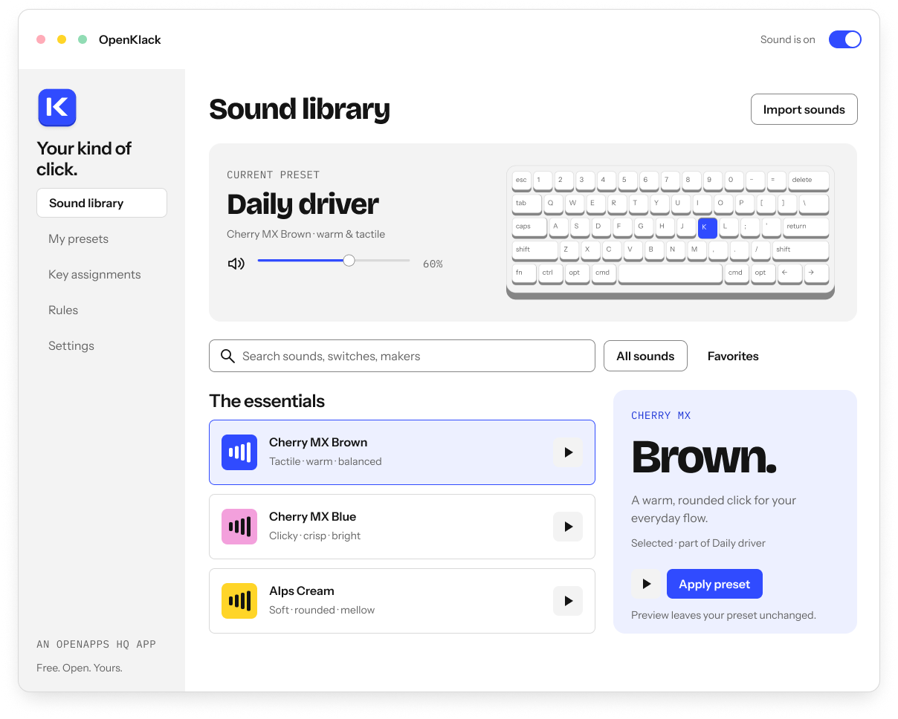

<div align="center">


**The deep thock. The crisp click. Your everyday keyboard, with a sound of its own.**

[Explore the design](https://www.figma.com/design/2fvzpabR06HanNwQIxxtm1/OpenApps-HQ-%C2%B7-Tactile-Studio) · [Run locally](#try-it-locally) · [App UI](design/openklack-app-ui.md) · [Contribute](#make-it-better)

**Free & open source · Mac first · No account · Local by default**

</div>

<br />

OpenKlack is a small menu-bar app that adds recorded mechanical keyboard sounds to the keyboard you already own.
Find a sound you love, close settings, and get on with your day.

The Mac utility and its interactive marketing website live together in this repository.
The native engine handles input and audio independently of the React settings window.

> **In development.**
> A local Mac app is working, but a signed, notarized public download is not available yet.
> The current launch target is macOS 14+ on Apple Silicon.
> See the [verification record](design/desktop-verification.md) for what has been tested and what remains.

## Small app. Plenty of character.

| Find your signature | Make it your own | Keep it out of the way |
| --- | --- | --- |
| 18 bundled sound packs, from a rounded thock to a sharp click. | Give Space its own sound, tune playback levels, and save favorite presets. | Mute, volume, and favorites stay in the menu bar. Close settings; keep the sound. |
| Preview a consistent comparison before applying anything. | Import compatible packs or individual recordings. Export portable presets with their audio and credits. | Pause for microphone activity or selected apps, with a visible reason and temporary resume. |

- **Real recordings:** 793 sample regions, with genuine key-release recordings and alternate samples where supplied.
- **Predictable presets:** installed sound versions stay pinned until you explicitly apply an update.
- **Physical key movement:** modifiers make sounds; holding a key does not retrigger presses.
- **Local by default:** no account or automatic telemetry; diagnostics are reviewed and exported by you.
- **A shared identity:** original OpenApps HQ and OpenKlack marks, light/dark tokens, and restrained Motion transitions.

## A look at the new app design

<picture>
  <source media="(prefers-color-scheme: dark)" srcset="design/assets/openklack/ui/settings-dark.png" />
  
</picture>

The image is the target design from Figma, not a screenshot of the current native settings UI.
The [complete app UI specification](design/openklack-app-ui.md) covers onboarding, permissions, the menu bar, library, presets, key assignments, rules, settings, recovery, and accessibility.
The website already uses the new identity; the desktop layout redesign is a separate next step.

## Try it locally

Use Node.js 24, pnpm 12.4.1, and the repository's Vite+ toolchain.
Native desktop development also needs macOS, Xcode Command Line Tools, and Rust.

```sh
git clone https://github.com/openappshq/openklack.git
cd openklack
pnpm install
pnpm dev
```

Open the URL printed by Vite+ to try the website and keyboard playground.
Enable sound, click the keyboard, and type, or preview packs from the library.
Browser sound works only while that interactive keyboard is focused.

For the native Mac utility:

```sh
pnpm desktop
```

Grant OpenKlack Input Monitoring access when prompted if you want typing sounds across other apps.
The app processes key events locally without storing typed text.
Sound previews remain separate from applying a preset.

| Command | Purpose |
| --- | --- |
| `pnpm dev` | Marketing website and browser playground. |
| `pnpm build` | Production website in root `dist/`. |
| `pnpm desktop` | Native Mac app in development mode. |
| `pnpm desktop:build` | Local native bundle; public distribution needs signing and notarization. |
| `pnpm test` | Shared-layout and sound-catalog tests. |
| `pnpm desktop:test` | Native input, audio, storage, import, and updater checks. |
| `pnpm lint` | Repository TypeScript and lint checks. |
| `pnpm theme` | Regenerate CSS from the Figma token export. |

The [development and release guide](docs/development.md) covers signing, packaging, sound imports, update configuration, and the CI workflow.

## One repository, clear boundaries

```text
apps/
  website/           Marketing site and live keyboard playground
  desktop/           React settings + Tauri + native input/audio
packages/
  keyboard-layout/   Shared key geometry and readable logical labels
  soundpacks/        Recorded catalog, audio assets, and credits
  ui/                Shared Motion policy and transition defaults
design/
  assets/            Exact Figma logos and interface exports
  tokens.json        Tactile Studio primitives and semantic themes
  tokens.css         Generated token bindings
docs/
  development.md     Local setup, packaging, and release guide
```

**Website:** React, TypeScript, HeroUI, Three.js / React Three Fiber, Drei, maath, Howler, and Motion.
**Desktop:** Tauri 2, React, HeroUI, Motion, Rust/Rodio audio, and a small macOS input bridge.
**Workspace:** pnpm and Vite+ handle both apps without an additional task runner.

Audio lives in the native engine, outside animation and React rendering.
Motion respects reduced-motion preferences and the Figma timing scale; closing settings destroys its WebView.
Website and desktop share recordings and logical-key data without depending on each other's source directories.

## Make it better

[Report a bug](https://github.com/openappshq/openklack/issues) or open a pull request with a focused change and the relevant checks.
For sound or input bugs, include your macOS version, keyboard layout, audio output, and a short reproduction.
Review any local diagnostics before attaching them; do not include recordings of your typing or private account information.

Useful starting points:

- [Product and architecture decisions](design/desktop-plan.md).
- [Release verification and remaining hardware checks](design/desktop-verification.md).
- [Tactile Studio design system](design/README.md).
- [Sound-pack architecture and provenance](design/thock-sound-architecture.md).

Windows and Linux support can follow when the experience is dependable.
Mobile is deferred because an iOS app cannot add sounds to another app's existing keyboard.

## Credits and license

OpenKlack source is [MIT licensed](LICENSE).
The 18 bundled sound packs are distributed by [Thock soundpacks](https://github.com/kamillobinski/thock-soundpacks), with recordings originally from Mechvibes and kbsim.
Their credits, licenses, and source revision stay with the [shared catalog](packages/soundpacks/catalog.json) and [sound notices](packages/soundpacks/sounds/NOTICE.txt).

The browser playground retains the supplied Raycast reference model and its [provenance](apps/website/public/keyboard/PROVENANCE.md).
That model's presence is not a claim of permission for every redistribution; it remains separate from the source license and original OpenKlack desktop keyboard.
The original brand assets are exported from the [Figma masters](design/assets/README.md).

---

<div align="center">


**An OpenApps HQ original.**

Small apps. Room for personality.

[OpenApps HQ](https://github.com/openappshq) · [OpenKlack](https://github.com/openappshq/openklack)

</div>
