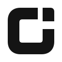
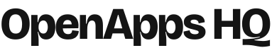

<div align="center">




**Small apps. Big personality.**

Free & open source desktop tools, built in one workspace.

[Development guide](docs/development.md) · [Design system](design/README.md) · [Issues](https://github.com/openappshq/openklack/issues)

</div>

| Our apps | A closer look |
| :--- | :---: |
| **OpenKlack** · Mechanical keyboard sounds for the keyboard you already own.<br />Mac app in development · [App source](apps/openklack-desktop) · [Marketing pages](apps/website/src/apps/openklack) |  |
| **OpenReaction** · Emoji shortcodes everywhere on your Mac.<br />[App source](apps/openreaction) · [Marketing pages](apps/website/src/apps/openreaction) |  |

## Run locally

Requires Node.js 24 and pnpm 12.4.1; the Mac app also needs Rust and Xcode Command Line Tools.

```sh
pnpm install
pnpm dev              # OpenApps website, including /OpenKlack/
pnpm openklack:dev    # OpenKlack desktop app
```

`apps/website` hosts all product pages; desktop projects live alongside it, including `apps/openklack-desktop` and `apps/openreaction`.
`packages/ui` shares the design system and motion; product packages stay independent.
Add a product through the [app catalog](apps/website/src/catalog.ts) using the [onboarding guide](docs/development.md#add-another-app).

[MIT](LICENSE) · [Model provenance](packages/openklack-ui/assets/keyboard/PROVENANCE.md) · [Sound credits](packages/soundpacks/sounds/NOTICE.txt)
