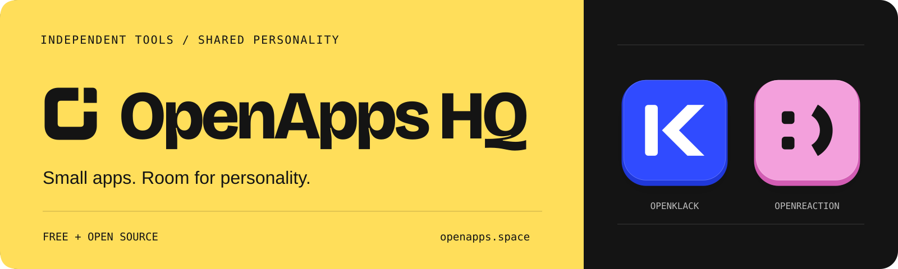
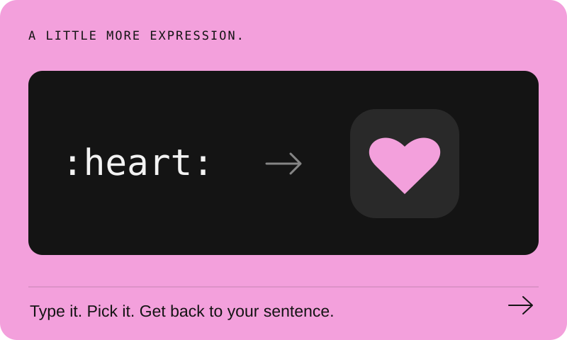
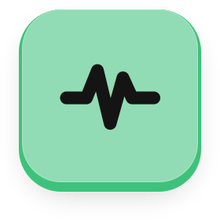

<div align="center">

<a href="https://openapps.space"></a>

Free, open-source Mac apps. One home for their code, websites, and design system.

[Website](https://openapps.space) · [Development](docs/development.md) · [Design system](design/README.md) · [Issues](https://github.com/openappshq/openapps/issues)

</div>

| Our apps | A closer look |
| :--- | :---: |
| **OpenKlack**<br />Mechanical keyboard sounds for the keyboard you already own.<br />[Try the sounds](https://openapps.space/openklack/) · [Source](apps/openklack-desktop) |  |
| **OpenReaction**<br />Emoji shortcodes in every text field on your Mac.<br />[Try the demo](https://openapps.space/openreaction/) · [Source](apps/openreaction) |  |
| **Hertz**<br />Native macOS menu-bar system monitor. Free.<br />[Install with Homebrew](https://openapps.space/hertz/) · [Source](apps/hertz) |  |

OpenKlack and OpenReaction are in development; their public Mac downloads are coming later. Hertz installs with `brew install --cask openappshq/tap/hertz` once its first release is tagged.

## Run locally

Requires Node.js 24 and pnpm 12.4.1. See each app’s build requirements in the [development guide](docs/development.md).

```sh
git clone https://github.com/openappshq/openapps.git
cd openapps
pnpm install
pnpm dev              # OpenApps website, including /openklack/
pnpm openklack:dev    # OpenKlack desktop app
```

`apps/` contains the shared website and each desktop app. `packages/` holds shared code; `design/` holds the organization’s visual system. [Add an app →](docs/development.md#add-another-app)

[MIT](LICENSE) · [Model provenance](packages/openklack-ui/assets/keyboard/PROVENANCE.md) · [Sound credits](packages/soundpacks/sounds/NOTICE.txt)
