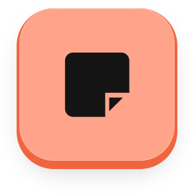

<div align="center">

<a href="https://openapps.space"></a>

Open-source Mac apps, each $5 once after a free 3-day trial. One home for their code, websites, and design system.

[Website](https://openapps.space) · [Development](docs/development.md) · [Design system](design/README.md) · [Issues](https://github.com/openappshq/openapps/issues)

</div>

| Our apps | A closer look |
| :--- | :---: |
| **OpenKlack**<br />Mechanical keyboard sounds for the keyboard you already own.<br />[Try the sounds](https://openapps.space/openklack/) · [Source](apps/openklack-desktop)<br />`curl -fsSL https://openapps.space/install/openklack \| sh` |  |
| **OpenReaction**<br />Emoji shortcodes in every text field on your Mac.<br />[Try the demo](https://openapps.space/openreaction/) · [Source](apps/openreaction)<br />`curl -fsSL https://openapps.space/install/openreaction \| sh` |  |
| **Hertz**<br />Native macOS menu-bar system monitor.<br />[Install](https://openapps.space/hertz/) · [Source](apps/hertz)<br />`curl -fsSL https://openapps.space/install/hertz \| sh` |  |
| **macPaper**<br />Wallpapers made from the menu bar: gradients, mesh, patterns, pixelized photos.<br />[Install](https://openapps.space/macpaper/) · [Source](apps/macpaper)<br />`curl -fsSL https://openapps.space/install/macpaper \| sh` |  |
| **OpenNotes**<br />Sticky notes docked to the edge of your screen; every note a Markdown file, on your Mac or in iCloud Drive.<br />[Install](https://openapps.space/opennotes/) · [Source](apps/opennotes)<br />`curl -fsSL https://openapps.space/install/opennotes \| sh` |  |

Every released app installs with one Terminal line, no Homebrew needed: the command downloads the signed release, checks its digest, puts the app in `/Applications` and opens it ([how it works](RELEASES.md#install-script)). Prefer Homebrew? `brew install --cask openappshq/tap/<app>`. The trial starts the first time the app opens, no signup.

## Run locally

Requires Node.js 24 and pnpm 12.4.1. See each app’s build requirements in the [development guide](docs/development.md).

```sh
git clone https://github.com/openappshq/openapps.git
cd openapps
pnpm install
pnpm dev              # OpenApps website, including /openklack/
pnpm openklack:dev    # OpenKlack desktop app
```

`apps/` contains the shared website and each desktop app. `packages/` holds shared code; `design/` holds the organization’s visual system. [Add an app →](docs/development.md#add-another-app)

[MIT](LICENSE) · [Model provenance](packages/openklack-ui/assets/keyboard/PROVENANCE.md) · [Sound credits](packages/soundpacks/sounds/NOTICE.txt)
