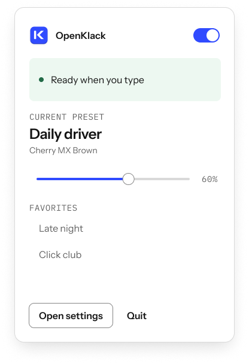
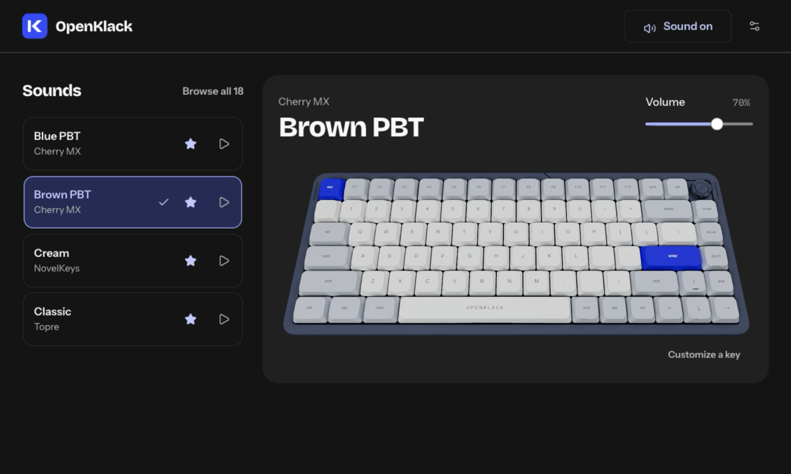

<div align="center">


**Mechanical keyboard sounds for the keyboard you already own.**

Free & open source · Mac first · No account · No telemetry

[Get started](#get-started) · [Design system](design/README.md) · [Report a bug](https://github.com/openappshq/openklack/issues)

</div>

| A little daily delight | Design preview |
| :--- | :---: |
| **Find your sound.** 18 recorded switch packs, with preview before Apply. |  |
| **Keep it close.** Mute, volume, and favorite presets in your menu bar. |  |
| **Make yourself at home.** Light, dark, or your Mac’s appearance. |  |

<sub>Figma design previews; the current menu uses native macOS controls.</sub>

## Get started

**In development:** macOS 14+ on Apple Silicon; no public notarized download yet.
Requires Node.js 24, pnpm 12.4.1, Rust, and Xcode Command Line Tools.

```sh
git clone https://github.com/openappshq/openklack.git
cd openklack
pnpm install
pnpm desktop  # Mac app
# pnpm dev   # Website
```

[Setup & installation](docs/development.md) · [App UI](design/openklack-app-ui.md) · [Verification](design/desktop-verification.md)

---

[MIT](LICENSE) · [Sound credits](packages/soundpacks/sounds/NOTICE.txt) · [Reference asset credits](apps/website/public/keyboard/PROVENANCE.md)

<div align="center">


**An [OpenApps HQ](https://github.com/openappshq) original.**

</div>
