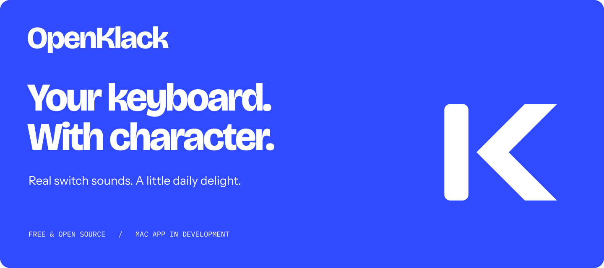
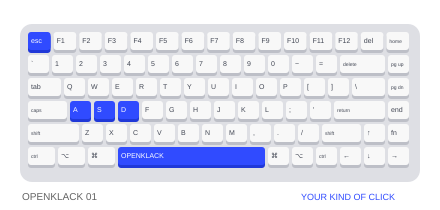
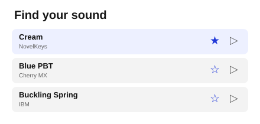
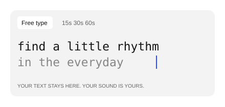

<div align="center">



**Mechanical keyboard sounds for the keyboard you already own.**

Free & open source · Mac first · No account · No telemetry

[Get started](#get-started) · [Design system](design/README.md) · [Report a bug](https://github.com/openappshq/openklack/issues)

</div>

| Make it yours | A closer look |
| :--- | :---: |
| **Play your keyboard.** Live 3D keys and reactive lighting. |  |
| **Find your sound.** 18 packs, starred favorites, and optional per-key sounds. |  |
| **Try it on the website.** A basic typing test with your chosen sound. |  |

<sub>Feature illustrations. The Mac app keeps mute, volume, favorites, and pause reasons in a native menu.</sub>

## Get started

**In development:** macOS 14+ on Apple Silicon; no public notarized download yet.
Requires Node.js 24, pnpm 12.4.1, Rust, and Xcode Command Line Tools.

```sh
git clone https://github.com/openappshq/openklack.git
cd openklack
pnpm install
pnpm desktop  # Mac app
# pnpm dev   # Website
```

[Setup & installation](docs/development.md) · [App UI](design/openklack-app-ui.md) · [Verification](design/desktop-verification.md)

---

[MIT](LICENSE) · [Prototype model provenance](packages/ui/assets/keyboard/PROVENANCE.md) · [Sound credits](packages/soundpacks/sounds/NOTICE.txt)

<div align="center">


**An [OpenApps HQ](https://github.com/openappshq) original.**

</div>
