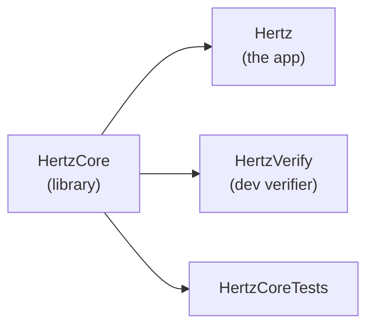
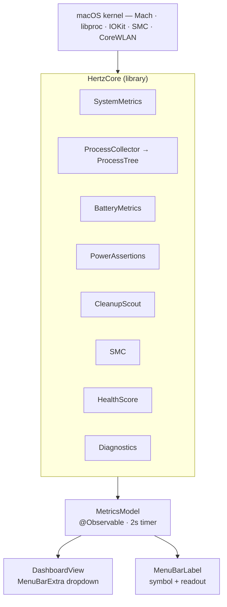
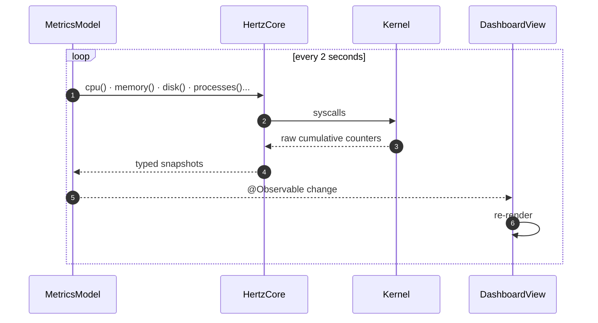
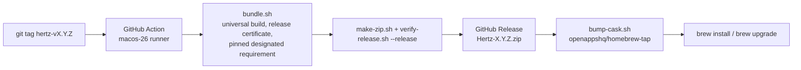

# Architecture

How Hertz is put together — for anyone working on it.

## Shape

A SwiftUI menu-bar app with no third-party dependencies. Everything is read
from the OS directly (Mach, libproc, IOKit, SMC, CoreWLAN). Swift 6.2, built
with SwiftPM. The look is the OpenApps HQ Tactile Studio system: the shared
type (Bricolage Grotesque, Instrument Sans, IBM Plex Mono), the green
signature colour, and glass card surfaces (Liquid Glass on macOS 26, a
system material before that, opaque under Reduce Transparency).

## Targets

```
Sources/HertzCore/     library — metric collectors, pure data, formatting, no UI
Sources/Hertz/         executable — the SwiftUI menu-bar app
Sources/HertzVerify/   executable — dev-only metric verifier
Tests/HertzCoreTests/  XCTest — pure logic only, never the live system
```



- **HertzCore is a library** so the app, the verifier and the tests exercise
  the exact same collector code — what you verify is what ships.
- **HertzVerify is an executable**, not a test: it reads the live machine and
  compares against `df`, `vm_stat`, `top`, `ps`, `pmset` and `ioreg`. It
  never lands in the app bundle.
- **HertzCoreTests** cover the health score, diagnosis, the process tree,
  formatting, the menu-bar readout and the Cleanup Scout's path rules
  (against a temporary home directory). Nothing in it needs a permission,
  so it runs in CI.
- App and library targets are `MainActor`-isolated by default
  (`defaultIsolation`, Swift 6.2); pure helpers such as `Format` are
  `nonisolated`. Collectors are plain synchronous code.

## Data flow



`MetricsModel` runs a 2-second timer on the main actor, calls every collector,
stores the snapshots, derives diagnosis rows, and records a small ring buffer
of recent pressure changes. The SwiftUI views observe the model and re-render.
There is no background work besides that timer: Hertz never contacts the
network.

### The refresh cycle



## The collectors (`HertzCore`)

| File | Provides | OS interface |
| --- | --- | --- |
| `SystemMetrics.swift` | CPU, thermal pressure, memory pressure, disk, network, hardware info | Mach `host_*`, Darwin notify, `sysctl`, `statfs`, IOKit, `getifaddrs`, CoreWLAN |
| `Format.swift` | bytes, rates, durations and percentages, the same everywhere | (pure) |
| `MenuBarReadout.swift` | what the menu bar prints beside the symbol | (pure) |
| `ProcessCollector.swift` | process list — pid, name, CPU, memory, path | `libproc` |
| `ProcessTree.swift` | parent/child forest + subtree CPU/memory sums | (pure transform of the process list) |
| `BatteryMetrics.swift` | charge, health, cycles, temperature, battery/adapter wattage | IOKit power sources + `AppleSmartBattery` registry |
| `PowerAssertions.swift` | active sleep/display blockers grouped by process | IOKit `IOPMCopyAssertionsByProcess` |
| `CleanupScout.swift` | read-only scan and measurement of allowlisted cache paths; never deletes | `FileManager` |
| `SMC.swift` | CPU temperature, fan speed | the `AppleSMC` user client |
| `HealthScore.swift` | composite 0–100 score | (pure function of the snapshots) |
| `Diagnostics.swift` | current bottleneck, shareable report text | (pure function of the snapshots) |

## Metric accuracy — the non-obvious bits

These were all found and fixed against `top` / Activity Monitor / `ioreg`:

- **Rates need two samples.** The kernel exposes *cumulative counters* (CPU
  ticks, bytes transferred). Any `%` or `/s` value is a delta between two
  reads over the elapsed time.
- **Per-process CPU** — `proc_taskinfo`'s `pti_total_*` are Mach
  absolute-time units, **not nanoseconds**. They're converted with
  `mach_timebase_info` (1/1 on Intel, 125/3 on Apple silicon).
- **CPU total** — the arithmetic mean of per-core percentages. Matches `top`;
  a tick-weighted ratio skews on Apple silicon as cores park.
- **Thermal pressure** — Darwin's `com.apple.system.thermalpressurelevel`
  notification keeps the useful moderate/heavy split. If that private-but-stable
  signal is unavailable, Hertz falls back to `ProcessInfo.thermalState`.
- **Process memory** — physical footprint (`proc_pid_rusage`), not RSS.
  Matches Activity Monitor's "Memory" column.
- **Memory pressure** — uses the kernel pressure sysctls when available:
  `vm.memory_pressure` for the 0-100 signal and
  `kern.memorystatus_vm_pressure_level` for the normal/warning/critical band.
- **Disk** — the physical-disk view (whole volume), not `df`'s per-volume
  "used", which hides other APFS volumes and snapshots.

The `HertzVerify` tool cross-checks every metric against an independent system
command and must report `ALL CHECKS PASSED`.

## The app (`Hertz`)

| File | Role |
| --- | --- |
| `HertzApp.swift` | `@main` App — `MenuBarExtra` (`.window` style) with the symbol-and-readout label; `AppDelegate` owns the model, preferences, login item and windows |
| `Brand.swift` | Tactile Studio tokens: colours (light/dark), spacing, radii, motion, the three typefaces; bundled resources |
| `Surfaces.swift` | `cardSurface()` (glass / material / opaque), button styles, `MonoLabel` |
| `Preferences.swift` | the saved settings: readout, visible cards, welcome shown |
| `MetricsModel.swift` | `@Observable` state + the 2s refresh timer |
| `Dashboard/DashboardView.swift` | the dropdown: health card, the reading cards, the footer |
| `Dashboard/Cards.swift`, `Charts.swift` | `Card`, `CardHeader`, `Readout`, `StatePill`, sparkline, core bars, ring, bar |
| `Dashboard/VitalsCards.swift` | CPU, memory, disk, network, battery |
| `Dashboard/DiagnosisCards.swift` | diagnosis with recent events; sleep blockers |
| `Dashboard/ProcessCard.swift` | the process tree, sorting, context-menu actions |
| `Dashboard/CleanupCard.swift`, `CleanupModel.swift` | Cleanup Scout: scan, sizes, reveal in the Finder, copy the report |
| `Settings/SettingsWindow.swift` | Settings: Open at login, readout, visible cards, the Homebrew update note, diagnostics |
| `Onboarding/WelcomeWindow.swift` | the one-screen welcome shown after install |
| `ProcessActions.swift`, `PowerAssertionActions.swift` | copy / reveal / Activity Monitor actions; nothing that signals a process |

### Dropdown layout

```
┌────────────────────────────────────────────────┐
│ ╭────────────────────────────────────────────╮ │
│ │ 96 Excellent ●                    UP 1D 4H │ │  health card
│ │ Apple M4 · 4P + 6E · 16 GB · macOS 26.5    │ │
│ ╰────────────────────────────────────────────╯ │
│ ╭ DIAGNOSIS ─────────────────────────────── ⧉ ╮ │  bottleneck, recent events
│ ╭ SLEEP BLOCKERS ────────────────────── ⧉ ◎ ╮ │  only while something holds sleep
│ ╭ CPU ──────────────────────────── HIGH 74.9% ╮ │  sparkline, per-core bars, load
│ ╭ MEMORY ──────────────────────────────── 66% ╮ │  sparkline, used · free · swap
│ ╭ DISK ─────── ◔ ╮ ╭ NETWORK ────────────── ╮ │  two half-width cards
│ ╭ BATTERY ──────────────────────────── ⚡ 100% ╮ │
│ ╭ PROCESSES ───────────────────── ⌄CPU   MEM ╮ │  tree, expandable, context menu
│ ╭ CLEANUP SCOUT ────────────────── ⧉  Rescan ╮ │
├────────────────────────────────────────────────┤
│ ∿ HERTZ 0.2.0                 Settings…  Quit  │  footer
└────────────────────────────────────────────────┘
```

A scrolling stack of glass cards (`cardSurface()`: Liquid Glass on macOS 26,
`.regularMaterial` before, an opaque surface under Reduce Transparency, a
visible rim under Increase Contrast). Every card header is a mono label with
the headline reading on the right in tabular IBM Plex Mono. Readings stay in
the text colour; a state that needs attention adds a `HIGH` / `CRITICAL` pill
and colours the chart, never the text alone, because the healthy colour is
also the brand accent.

Process rows expose contextual actions for troubleshooting: copy PID/path,
reveal the executable or app bundle in Finder, and open Activity Monitor.
Hertz never signals a process. A row is a two-second-old snapshot of a PID
and a path, and neither is an identity: a PID can be reused by another
process, even one with the same executable, between the snapshot and a
click, and re-reading the path before signalling only narrows that window.
Terminating is Activity Monitor's job, where the target is what you see.

Sleep Blocker Watch reads active IOKit power assertions and groups meaningful
system/display sleep blockers by process. Hertz suppresses baseline "user is
active" style assertions and known display-on noise, then shows a compact row
only when something is actually holding sleep. Actions are intentionally
read-only: copy a report, reveal the app/executable when the path is known, or
open Activity Monitor. Hertz does not clear another process's assertion because
it may be protecting real work such as a call, backup, transfer, render, or
build.

Cleanup Scout is deliberately not part of the 2-second metrics loop and is
read-only. Users start a scan manually, see the allowlisted cache groups and
their sizes, and can reveal a folder in the Finder or copy the report; the
deleting, if any, happens there. The scanner only lists allowlisted paths under
the current user's home directory, refuses broad user-data roots such as
Documents, Application Support, Containers, Preferences, Mail, Messages,
Keychains and system locations, and refuses any path with a symbolic link
anywhere between the home directory and the cache, so a replaced ancestor can
never point it outside the home. Deleting from Hertz was removed on import:
a pathname-based delete cannot be made safe against a directory that is
swapped for a symlink between the scan and the click.

## Updates

Hertz has no in-app updater. `brew upgrade --cask hertz` is the update path;
the app never contacts a feed or a release API, and `scripts/verify-release.sh`
fails a build whose binary references one. The reasons and the plan to adopt
the shared `packages/openapps-updater` are in [RELEASING.md](../RELEASING.md).

## Build & release pipeline



The whole flow, the one-time setup and a local rehearsal without secrets are
in [RELEASING.md](../RELEASING.md); the contract every OpenApps HQ app
follows is [RELEASES.md](../../../RELEASES.md).

## Distribution model

The app is signed with the stable, self-signed **OpenApps HQ Release**
certificate and is not notarized. Installs go to `~/Applications`, user-owned,
so an upgrade needs no admin password. The cask's `postflight` strips the
download quarantine so there's no Gatekeeper prompt. Hertz asks for no
permissions, so nothing about it is tied to the signature except that
`brew upgrade` replaces the same app in place.
