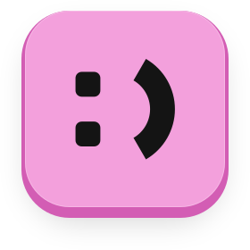

<div align="center">



# OpenReaction

**Type `:tada:` in any text field on your Mac. Get 🎉.**

Free & open source · Mac native · No account · No telemetry

[Build and run](#build-and-run) · [Architecture](docs/architecture.md) · [Report a bug](https://github.com/openappshq/openapps/issues)

</div>

## What it does

- Slack/Discord-style `:shortcode:` emoji autocomplete in any app
- A glass pill of emoji at your caret: arrow keys to choose, Return or Tab to insert, Esc to dismiss
- A full `:tada:` with the closing colon turns straight into 🎉
- Emoji, names and languages come from macOS itself; familiar shortcodes like `:+1:` still work
- Stays out of password fields, secure input, terminals and apps that already expand shortcodes — the app list in Settings shows the defaults and lets you switch them on or add your own
- Liquid Glass on macOS 26 Tahoe, native materials on Sonoma and Sequoia
- GIFs and stickers are planned

## Requirements

macOS 14 Sonoma or later.

OpenReaction needs **Accessibility** and **Input Monitoring** permission to notice shortcodes as you type and insert the result into the app you are using.

**Privacy.** Keystrokes are inspected in memory as they pass, only to spot a shortcode after a colon, and are never stored, logged or sent anywhere. Outside a shortcode nothing is kept beyond whether the last character was part of a word; a shortcode is kept only while you type it. When macOS Secure Input is on (most password fields, Terminal's Secure Keyboard Entry) OpenReaction reads nothing. Other password fields are detected through Accessibility on a best-effort basis: macOS reports focus changes asynchronously, so a field that becomes a password field programmatically can be seen a moment late. To rank suggestions, OpenReaction remembers which emoji you pick (on this Mac only, with the day of last use); Settings has a "Clear Usage History" button.

## Build and run

Requires Xcode 26 (Swift 6.2 or later).

```sh
swift build          # debug build
swift test           # unit tests for the core library
scripts/bundle.sh    # release build → build/OpenReaction.app
```

`scripts/bundle.sh` signs with `APPLE_SIGNING_IDENTITY` when set, and ad-hoc otherwise:

```sh
APPLE_SIGNING_IDENTITY="Apple Development: Your Name (TEAMID)" scripts/bundle.sh
open build/OpenReaction.app
```

macOS ties Accessibility and Input Monitoring grants to the code signature. Ad-hoc signatures change with every build, so use a stable identity while developing, or grant the permissions again after each rebuild.

To check the picker's look without permissions or the event tap:

```sh
swift run OpenReaction --preview-picker   # ← → move the selection
```

Regenerate the app icon and menu-bar image from the SVG masters in `design/assets` with `scripts/make-icons.sh`.

## Architecture

| Layer | Where | Notes |
| --- | --- | --- |
| Keystroke capture | `KeyboardTap` | Active session `CGEventTap` on its own thread, so picker keys can be swallowed; re-enables itself if macOS times it out |
| Trigger | `TriggerMachine` (core) | Pure state machine over a short typed tail: word-boundary colons, backspace, dismiss, closing colon |
| Emoji data | `AppleEmojiData`, `EmojiCatalog` (core) | macOS CoreEmoji names, gemoji shortcodes, CoreText render check |
| Search | `EmojiSearch` (core) | Tiered ranking: shortcode, words, keywords, stems, fuzzy, typos; frecency within tiers |
| Caret | `CaretLocator` | Accessibility text bounds off the main thread, with fallbacks |
| Picker | `PickerPanel`, `PickerView` | Non-activating panel that never takes focus; `PanelPlacement` (core) positions it |
| Insertion | `TextInserter` | Synthetic backspaces plus Unicode key events, leaving the clipboard alone |

The reasoning behind each choice is in [docs/architecture.md](docs/architecture.md).

## Credits

Emoji shortcodes and tags from [gemoji](https://github.com/github/gemoji) (MIT). Fonts: Bricolage Grotesque, Instrument Sans and IBM Plex Mono (SIL OFL). See [NOTICE](NOTICE).

---

<div align="center">


**[MIT](LICENSE) · An [OpenApps HQ](https://github.com/openappshq) original.**

</div>
