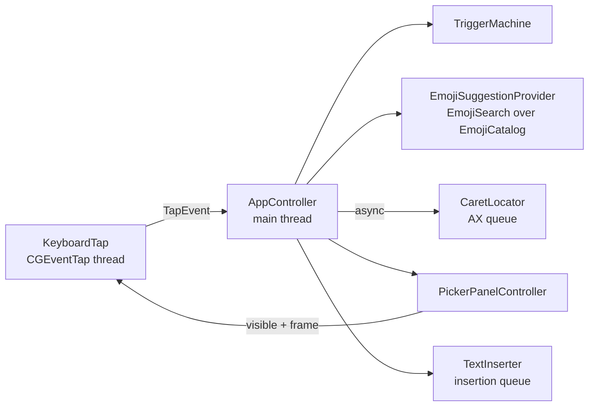

# Architecture

OpenReaction is a menu-bar app that watches typing system-wide, recognizes `:shortcode` tokens, shows a picker at the caret, and replaces the token with an emoji.



`OpenReactionCore` holds everything that can be tested without a window server: the trigger state machine, catalog and search, panel placement, preferences, permission flow. `OpenReaction` is the AppKit/SwiftUI shell.

## 1. Keystroke capture — `KeyboardTap`

**Active, session-level `CGEventTap`.** A listen-only tap (or `NSEvent` global monitor) can observe keys but cannot remove them. While the picker is open, arrows, Return, Tab and Esc must not reach the host app, so the tap is created with `.defaultTap` and returns `nil` for those events. A swallowed press stays *owned* until its key-up: repeats and the release are swallowed too, so the host never sees an orphaned key-up or a stray repeat after the picker closed. Only unmodified keys count; ⌘, ⌃ and ⌥ chords belong to the host and reset typing.

**The tap is thin.** It turns each event into a `KeyEvent` (key code, up/down, repeat, modifiers, whether secure input is on) or a mouse event and asks the gate what to do. Typed characters are decoded only when the gate calls the decoder: for the colon/boundary check in a validated field, or inside a validated token. Held keys are decoded only after their token probe answered, from the tap's stored copies. In a password field or an unknown field, keystrokes pass through without being read.

**Ordering is by construction.** Every input — tap events, mouse downs, focus notifications, probe answers, verification results, flush acknowledgements, watchdog timeouts — goes through one lock into the pure `InputGate`, so the gate sees one ordered stream regardless of thread. Effects that post events are enqueued on the single insertion queue while that lock is still held, so they reach the event stream in the order the gate decided.

**Replacement transactions.** A replacement is a transaction with an id. Physical keys are held from the moment it begins; verification runs; on success the deletes, the emoji and a *flush* marker carrying the id are posted; when the marker comes back through the tap everything before it has reached the host, so held keys are fed through the gate once (history sees them) and those that pass are replayed, followed by another flush; this repeats until nothing new arrived, then the gate reopens. The watchdog stays armed until that point; a lost flush is retried once and then the transaction is abandoned with a best-effort replay.

## 2. Trigger state machine## 2. Trigger state machine — `TriggerMachine`

The machine never sees the host's text. It mirrors a short tail of typed characters (64) and derives the active token from that tail after every input:

- A token is `:` followed by up to 30 shortcode characters (`a–z 0–9 _ + -`).
- The colon must follow a boundary: start of known text, whitespace, punctuation such as `(` or quotes, or an emoji. Letters, digits and URL/time punctuation (`: / \ . _ - + @ # & = ? % ~ $`) glue it to a word, so `http://`, `12:30` and `key:value` never trigger.
- Backspace pops the tail; re-deriving handles editing inside the query and backing over the colon.
- A closing `:` after a non-empty query reports `completedShortcode`; the controller replaces `:query:` if it is an exact shortcode.
- Esc dismisses the current token only; a new colon starts fresh.
- Anything that may move the caret without typing — click, app switch, arrows, Home/End, ⌘/⌃ shortcuts, Return/Tab when the picker is closed — resets the tail to "unknown", which counts as a boundary.

The picker opens once the query has two characters and at least one result.

### The gate — `InputGate`

Every decision about an event is made by one pure, single-threaded state machine (`OpenReactionCore/InputGate.swift`), tested with scripted event sequences typed with real US-layout key codes and modifier flags, plus a tap-level suite that drives the actual `CGEventTap` callback with constructed `CGEvent`s.

```mermaid
stateDiagram-v2
    [*] --> Idle
    Idle --> Idle: keys pass; only "last char was a word char" is kept
    Idle --> Probing: boundary colon → colon and following keys held, token probe requested
    Probing --> Idle: probe secure / unavailable / stale / cancelled → replay untouched
    Probing --> InToken: probe editable + tracked → held keys interpreted once, replayed, flushed
    InToken --> Idle: token ends (space, Esc, backspace over colon)
    InToken --> Verifying: closing colon / confirm / click (keys held)
    Verifying --> Authorized: verifyResult keystrokes
    Authorized --> Posting: commit succeeds at execution time (mouse held from here)
    Verifying --> Draining: refused · cancel
    Authorized --> Draining: cancel · commit refused
    Posting --> Draining: flushAck
    Draining --> Draining: flushAck with newly held events → drain, replay, re-flush
    Draining --> Idle: flushAck, nothing held → deferred colon or shortcode starts next
    Posting --> Recovering: second missed ack / tap re-enabled → replay held, flush
    Recovering --> Draining: flushAck → history reset to a boundary
    Recovering --> Idle: still no ack → replay owed in order, forget
```

Rules the gate enforces:

- **Retain nothing until a probe says the field is safe.** Outside a token the gate keeps one bit: whether the previous character was part of a word (for the colon boundary rule). Each character is looked at for that check and dropped. A boundary colon is *held*, together with every key after it, undecoded, while a token probe (focused element, subrole, pid, generation-tagged) runs off the tap thread. Only an answer of editable-and-tracked for the current generation lets the held keys be interpreted — once, in order — and replayed to the host; anything else replays them untouched. So a programmatic move into a password field whose notification has not arrived yet cannot leak typed text: at most the colon itself was read. Secure input drops the event and forgets typing; ⌘/⌃/⌥ chords are refused, Shift is ordinary typing.
- **Fail closed on focus.** A mouse down, Tab or Return reaching the host, a chord, app activation, an Accessibility focus notification, or lost focused-element tracking closes the gate before the event passes and bumps the focus generation.
- **Ownership.** A swallowed key press stays owned until released: its repeats and its key-up are swallowed whatever else happens. A held press keeps its release held until the flush after its replay is acknowledged, so a release can never overtake its own press.
- **Commit at execution time.** Verification only *authorizes*. The insertion queue asks the gate to `commit` under the lock right before posting; the transaction must still be current, uncancelled, on the same focus generation, open, tracked, with secure input off. From commit until the flush is acknowledged, mouse down/up/drag events are held too, so a click cannot land between the deletes and the emoji; they replay afterwards and the click still closes the gate.
- **Drains keep order.** Held events are fed through the gate once when drained; those that pass are replayed after the replacement's events. A drained colon at a boundary or a drained closing colon waits, with everything after it, for the next transaction, which starts as soon as the current one ends.
- **Recovery.** If acknowledgements stop, the gate re-flushes once, then replays what it holds while still holding new input (Recovering); an acknowledgement there resets history to a safe boundary, since what was replayed was never interpreted. If the stream stays silent, or the tap stops, everything owed goes out in order and typing is forgotten. No synthetic releases are ever posted; a key still physically down is resolved by its next real release.

**Verification (`CaretLocator.verify`)** is read-only and fails closed: the focused element must be the remembered one (`CFEqual`, same pid) and answer that it is not secure; the selection must be readable and empty with room for the token; the text before the caret must be readable (`AXStringForRange`) and equal the typed token. Anything else refuses, and the host is never touched by verification. Apps that expose no selection or text through Accessibility (most terminals, some Java/Qt/game windows, web views that have not enabled accessibility) therefore get no insertion — and usually no capture either, since they post no focus notifications.

`FocusMonitor` reports activation immediately, closes the gate, and registers an `AXObserver` for the frontmost app on a worker queue with a bounded messaging timeout, generation-checked; the gate is told whether focused-element notifications are in place. The frontmost app's exclusion is computed on the main thread and handed to the gate as an input, so the tap path never touches AppKit.

## 3. Emoji data and search — `AppleEmojiData`, `EmojiCatalog`, `EmojiSearch`

**The Mac is the source of truth.** At launch, `AppleEmojiData` reads `AppleName.strings` from `/System/Library/PrivateFrameworks/CoreEmoji.framework/Resources/<lproj>/` with `PropertyListSerialization`: the set of emoji macOS knows and their names in the user's language (nearest `.lproj` for the preferred languages, English as fallback). These are plain data files; no private API is linked or called, and nothing from them is copied into the repository. Tests use hand-written fixtures.

Every path is optional. Missing, unreadable or empty files fall back to English, then to the bundled gemoji list. Verified on macOS 26.5 only; layouts on 14 and 15 may differ, which the fallback covers.

The Character Viewer's search index (`SearchModel-*/term_index.plist`, `document_index.plist`) and `SearchEngineOverrideLists` are not used: they refer to emoji by numeric document id, and no public resource maps those ids to emoji strings. Keywords come from name words and gemoji tags instead.

**gemoji** (bundled, MIT) contributes Slack/GitHub shortcodes (`:+1:`, `:tada:`) and tags, only for emoji the Mac also lists. Emoji without a gemoji alias get a shortcode derived from the English name (`face_with_bags_under_eyes`).

**Render check.** An emoji newer than the installed Apple Color Emoji font would appear as a box. `EmojiRenderability` lays each candidate out with CoreText and keeps it only if it shapes to one run of one real glyph from Apple Color Emoji. That catches missing glyphs and ZWJ sequences that fall apart. Results are cached per OS build. If the font cannot be inspected, gemoji's `ios_version` is compared with the running macOS instead.

**Ranking.** Each emoji lands in its best tier; tiers never mix:

| Tier | Match |
| --- | --- |
| 0 | exact shortcode |
| 1 | shortcode prefix |
| 2 | word prefix in the name or a shortcode |
| 3 | exact keyword |
| 4 | keyword prefix |
| 5 | same English stem (`parties` → party) |
| 6 | fuzzy subsequence, 3+ characters, anchored at a word start, quality floor |
| 7 | one typo (Damerau-Levenshtein ≤ 1), 4+ characters |

Tiers 6 and 7 are fallbacks: they only fill in when tiers 0–5 found fewer than 4 emoji, a fuzzy match must start at a word start, and its fzy-style score must reach 70 of 100. Within a tier: frecency (use counts halving every 14 days), a small popularity prior, fuzzy quality (first, in the fuzzy tier), shorter text. Indexes are precomputed as byte arrays; a query over the full set stays well under 5 ms in release builds.

Frecency persists only the emoji, a decayed count and the day of last use — never the surrounding text — and Settings can clear it.

`Suggestion` and `SuggestionProvider` are deliberately not emoji-specific, so a GIF or sticker provider can plug into the same picker.

## 4. Caret position — `CaretLocator`

Accessibility calls are synchronous IPC into the target app and can hang, so they run on a private queue with `AXUIElementSetMessagingTimeout` (150 ms). The main thread awaits the result; the picker simply appears when it arrives.

1. System-wide element → `kAXFocusedUIElementAttribute`.
2. `kAXSelectedTextRangeAttribute` → `kAXBoundsForRangeParameterizedAttribute`. Many apps return nothing for an empty range, so the previous character's bounds are tried next.
3. The focused element's frame, if it is short enough to say something about the caret.
4. The mouse pointer.

The lookup happens once per token, when the colon is typed, so the picker stays anchored instead of chasing the caret. Accessibility uses top-left-origin coordinates; `PanelPlacement.appKitRect` converts them.

**Won't find the caret:** Electron and Chromium apps that don't expose text bounds unless their accessibility tree is forced on, most terminals (excluded by default anyway), games, remote desktops and VMs, Java/Qt apps with partial AX support, and canvas editors such as Figma or Google Docs. These fall back to the element frame or the pointer.

## 5. Picker — `PickerPanel`, `PickerView`

**Non-activating panel that never becomes key.** If the picker took focus, the host's text field would lose its caret and keystrokes would stop reaching it. The panel uses `.nonactivatingPanel`, refuses key and main status, floats at pop-up-menu level, and joins all Spaces and full-screen apps. Clicks on rows work through `acceptsFirstMouse` without activating OpenReaction.

The picker is a horizontal capsule of up to 8 emoji, sized close to a native text line: 26 pt cells, 4 pt padding (34 pt tall), 18 pt glyphs, a 12 pt IBM Plex Mono label, at most 340 pt wide, 6 pt below the caret. The selected emoji sits in an orchid-tinted capsule that widens to show its `:shortcode:` and slides between items; wider rows scroll so the selection stays visible with the next emoji peeking past a faded edge. Arrow keys in either axis move the selection, hover and clicks go through the same selection path, and VoiceOver announces the selected emoji's name.

`PillLayout` (pure, tested) computes cell widths, the scroll offset and a stable panel width sized for the longest label, so the panel never moves while the selection changes. `PanelPlacement.place` (pure, tested) puts it below the caret, flips above only when there is no room, and clamps to the visible frame of the display containing the caret.

On macOS 26 the pill is system Liquid Glass (`glassEffect`) and the selection is tinted interactive glass. Earlier systems use a behind-window popover material with a hairline rim and standard shadow. Reduce Transparency switches to an opaque surface, Increase Contrast strengthens edges and uses a solid selection, and Reduce Motion replaces the springs with a short fade.

## 6. Insertion — `TextInserter`

The typed token is removed with synthetic Delete presses, then the emoji is posted as a keyboard event carrying a Unicode string (`CGEventKeyboardSetUnicodeString`), in chunks that never split a grapheme.

**Why not the pasteboard:** pasting overwrites the user's clipboard, restoring it races the target app's asynchronous paste, clipboard managers record every emoji, and ⌘V is rebound or blocked in some apps. A Unicode key event goes through the app's normal typing path, so undo and field formatting behave as if the user typed it. GIFs will need the pasteboard, with explicit save and restore.

Known limitation: apps that read key codes instead of the Unicode string (some games, VMs, remote desktops) will see the virtual key used for the event.

## 7. Safety

- **Secure input.** If `IsSecureEventInputEnabled()` is on, OpenReaction does nothing. Password fields and apps like Terminal's Secure Keyboard Entry turn it on, and macOS then stops delivering keys to taps anyway.
- **Secure fields.** If the focused element's subrole is `AXSecureTextField`, the token is ignored. This covers web password fields that don't enable secure input. OpenReaction never observes or inserts into a password field.
- **Excluded apps.** Apps with their own shortcode pickers (Slack, Discord, Teams, Telegram…) and terminals (where `:` starts commands and Return must never be intercepted) are excluded by bundle id. The menu toggles the frontmost app; user changes are stored as differences from the default list.
- **Privacy.** Typed text lives only in the 64-character tail in memory, and only while the focused field is known to be editable. The only persisted data derived from use is the frecency list (emoji, count, day). Nothing is logged or sent; there is no network code.

## 8. Permissions

The tap needs **Input Monitoring**; reading the caret and posting events needs **Accessibility**. The tap starts only when both are granted and stops if either is revoked. macOS ties grants to the code signature: an ad-hoc signed rebuild counts as a new app, so sign with a stable identity during development.

macOS sends no notification when these switches change, so `PermissionMonitor` polls: every second while onboarding or the System Settings guide panel is visible, every 15 seconds otherwise, and immediately when OpenReaction becomes active. `PermissionFlow` (core, tested with an injected provider) turns those readings into a status per permission:

- **missing** or **requested** (System Settings was opened for it)
- **granted**
- **needsRelaunch**: both are granted but the tap still fails to start; macOS sometimes applies Input Monitoring only to a fresh process
- **stale**: granted earlier under a different code signature (after an update or re-sign), or still failing after a relaunch. Onboarding offers **Reset permission**, which runs `tccutil reset` for OpenReaction's own bundle id only and asks again.

OpenReaction is menu-bar only (`LSUIElement`, `.accessory`) and never shows a Dock icon. Opening the app again from Finder or Spotlight shows onboarding while setup is incomplete, otherwise Settings, so it stays reachable when the menu bar hides the status item.
