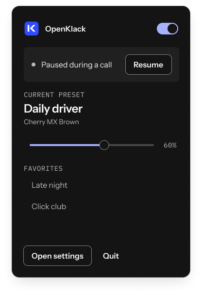

# OpenKlack app UI

The desktop app is a quiet menu-bar utility with an expressive, occasional-use settings window.
Most days, someone should only need mute, volume, and a favorite preset.
The settings window is where they discover a sound, give Space its own character, and make OpenKlack fit their routine.

This is the complete target UI specification for the Tactile Studio redesign.
The native settings interface now uses this design system, with five destinations, the current-preset keyboard summary, a sound list and inspector, and light, dark, and system appearances.
The detailed behavior below remains the target specification; items such as the welcome flow and fully styled menu popover are not all implemented.
The Figma file contains the light and dark Library composition and two menu states; the remaining screens and states below extend those same components.
Release verification and remaining hardware checks remain tracked in [desktop-verification.md](desktop-verification.md).

## Design source

[Figma: OpenApps HQ · Tactile Studio](https://www.figma.com/design/2fvzpabR06HanNwQIxxtm1/OpenApps-HQ-%C2%B7-Tactile-Studio?node-id=2-94).
The reusable token export is [tokens.json](tokens.json), with generated [tokens.css](tokens.css).
The exact logo masters and UI exports are in [assets](assets/README.md).

### Visual character

The interface feels like a useful creative tool: strong typography, quiet surfaces, a vivid accent, and a tactile keyboard.
Cobalt identifies OpenKlack; HQ yellow belongs to the parent organization; orchid is a secondary editorial or pack accent.
Keep decorative color out of routine errors, permissions, and system status.
Use the split-stem K mark in the app, with the full wordmark in onboarding and About.
Use the flat symbol as the monochrome menu-bar template image, so macOS can adapt it to the system appearance.
The exported shadowed icon is presentation artwork; create the platform icon bundle from the appropriate master when implementing packaging.

| Role | Light | Dark |
| --- | --- | --- |
| Window canvas | White `#FFFFFF` | Charcoal `#141414` |
| Grouped surface | `#F3F3F3` | `#202020` |
| Hover surface | `#EBEBEB` | `#2C2C2C` |
| Main text | `#141414` | `#F8F8F8` |
| Secondary text | `#626262` | `#BABABA` |
| Subtle divider | `#D9D9D9` | `#484848` |
| Control boundary | `#858585` | `#858585` |
| Primary action | Cobalt `#304BFF`, white text | Periwinkle `#A6B2FF`, charcoal text |
| Selected surface | `#EDF0FF` | `#242B55` |
| Positive status | `#236B48` on `#EDF8F1` | `#91DCB4` on `#163A29` |
| Error status | `#AC243C` on `#FFF0F2` | `#FFACB8` on `#4B2028` |

Bricolage Grotesque ExtraBold is the display voice: 40/44 for a major heading, 24/28 for smaller section titles.
Instrument Sans carries controls and reading text at 16/24, with 14/20 secondary labels.
IBM Plex Mono at 14/20 marks short categories, key names, and compact status metadata.
Reserve the 64/68 and 112/108 display sizes for brand and marketing compositions, not everyday settings.
Use the 4, 8, 12, 16, 24, 32, 48, 64, and 96 spacing scale.
Controls use an 8-pixel corner radius; larger panels use 16; tags and tiny decorative details use 4.
Default controls are 40 pixels high, compact controls 32, and touch-oriented targets at least 44.
Routine hover or press feedback takes 100 ms, panel changes 180 ms, and expressive transitions at most 260 ms.

## Window and navigation

Use one settings window with native macOS traffic-light controls and a persistent left sidebar.
The reference canvas is approximately 1160 × 920 before export shadow padding; the design must also work at 760 × 600.
At compact widths, retain readable navigation labels and stack the keyboard summary and content inspector instead of shrinking all text.
At narrow or short sizes, let the content scroll while keeping the current page heading and essential actions reachable.

The sidebar contains the app mark, a short brand phrase, five destinations, and a restrained playback status at the bottom.
Destinations are **Sound library**, **My presets**, **Key assignments**, **Rules**, and **Settings**.
Use a filled accent-subtle row, a clear label, and an accessible current-page state for the selected destination.
Do not use a badge count unless it communicates something actionable, such as one unavailable pack.

The main area begins with a page title and at most one primary page action.
A compact current-preset summary stays visible on Library and Key assignments, with name, base pack, volume, and playback status.
An app rule can change the effective preset; show both “Default: Daily driver” and “Using Late night in Terminal” when they differ.
Opening settings must not itself replace the preset the user was hearing.
Closing with Command-W destroys the visual window while the native input/audio utility continues.
Reopening restores saved choices, but cancels transient previews and physical-key selection mode.

## First launch and permission recovery

First launch opens a small welcome flow with the K app tile, “Your keyboard, with character,” and two actions: **Set up typing sounds** and **Explore sounds first**.
A user can preview bundled recordings without granting global input access.
Do not play sound on launch or request every permission at once.

The setup screen explains the specific permission before opening macOS settings: “OpenKlack needs Input Monitoring to hear key presses across your apps. Your typing is processed locally and isn’t saved.”
Its action is **Open Input Monitoring settings**.
Show “Waiting for permission” and a recheck control while the user is away; do not pretend a settings-link click granted access.
When the native observer confirms access, show a positive status and a short real-typing test area.
The test shows animated key feedback, without retaining or displaying a transcript.
Offer a fixed **Play test sound** action to distinguish output problems from keyboard-permission problems.

Finish with the current pack, a moderate volume, microphone pause enabled, and launch at login off until selected.
Explain that sounds follow the Mac’s current output, including speakers when headphones disconnect.
The final action is **Keep OpenKlack in the menu bar**.
No account, email gate, purchase step, or onboarding carousel is needed.

If permission is later revoked, preserve the preset and open a small repair banner with **Open Input Monitoring settings**.
Keep library previews available whenever the audio output works.
Secure Input is a separate state: explain that macOS is protecting input and sounds will return when it ends.
Do not direct the user to disable a security feature or request broader permission as a workaround.

## Menu-bar controls

The menu is the everyday product.
The Figma composition is a compact 368 × 560 panel with the mark and name, playback switch, optional pause reason, current preset, volume, favorites, and settings/quit actions.
Prefer native controls and menu behavior where they preserve keyboard access and background efficiency.
The visual panel is a styling target; it does not require a continuously running WebView.

| Area | Behavior |
| --- | --- |
| Playback switch | Changes manual mute; retains its saved value if an automatic pause occurs. |
| Status row | One plain-language reason, with the appropriate recovery or resume action. |
| Current preset | Name and base pack, with a clear indication of any app-rule override. |
| Volume | Native slider with readable percent, editing the effective preset heard now. |
| Favorites | A short list of favorited presets; selection applies immediately and identifies the active item. |
| Open settings | Opens or focuses the one settings window. |
| Quit | Stops the utility and audio, not merely the settings window. |

Automatic pause never visually turns the user's playback switch off.
Otherwise the switch would imply that the user chose to mute.
Use these reason/action pairs:

| State | Message | Action |
| --- | --- | --- |
| Playing | “Ready to play” | Mute |
| Manually muted | “Muted” | Unmute |
| Microphone active | “Microphone in use” | Resume temporarily |
| Microphone state uncertain | “Checking microphone activity” | Resume temporarily |
| App mute rule | “Paused in [app name]” | Resume temporarily |
| Input permission missing | “Input Monitoring needed” | Open permission settings |
| Secure Input | “Secure input is active” | Explanation; wait for macOS |
| Output unavailable | “Audio output unavailable” | Retry audio |
| Active pack damaged or missing | “This preset needs a sound pack” | Review and repair |

The Figma pause mockup says “Paused during a call”; implementation copy must use “Microphone in use” because microphone activity does not prove that someone is in a call.
Temporary resume bypasses the current automatic context only.
For a microphone pause it ends when that microphone context clears; for an app rule it ends when the user leaves that app.
Show “Resumed for this context” with a way to restore automatic pause.
Do not label the action “15 minutes” unless a real timed resume is implemented.
Manual mute, missing permission, Secure Input, unavailable audio, and a damaged preset always take priority over temporary resume.
When several blockers exist, display the highest-priority reason and expose the others in Settings.
Failed saves must restore the saved switch or volume state and show a clear error.

## Sound library

The Library opens with **The essentials**, a curated set of distinctly different sounds, followed by the full searchable catalog.
The current bundled catalog has 18 packs; derive counts from installed content rather than hard-coding them into the app.
Search matches maker, pack name, and type.
Provide filters for All sounds, Favorites, and Imported, with switch-type filters when useful.
Filters combine with search, and a visible clear action restores results.
Empty results say what did not match and offer **Clear filters**.
A completely empty imported collection offers **Import sounds**, not an error.

A pack row contains a recognizable color tile, maker, name, a short character descriptor, a favorite action, and an independent preview button.
Selection opens the inspector; selection alone never changes the active sound.
Use a visible active checkmark separate from the selected-row highlight.
The inspector shows the selected pack's name, character, type, press/release support, installed version, credits, and **Apply preset** or **Apply to selected key**, according to context.
Keep credits and technical version details behind a straightforward disclosure so the main comparison stays readable.

Preview plays the same short comparison rhythm each time, using the pack's genuine press/release samples where present.
Its play button becomes Stop, and starting another preview stops the previous one.
Stopping, leaving the window, or closing settings clears queued preview notes.
The saved pack, per-key assignments, and preset name stay unchanged during preview.
Match perceived pack loudness through playback gain while preserving the recording's character.
The primary Apply action loads the required audio first and changes the active configuration only after success.
Loading uses an inline progress state; failure keeps the last working preset and offers Retry.

A pack update appears as **New version available**, never as an automatic change to the user's sound.
Users can preview the new version before explicitly installing and applying it.
Presets retain their exact installed versions, including per-key assignments.
An unavailable version remains listed by its saved identity; do not silently substitute a similar pack.
Offer **Reimport this pack** or **Choose another sound**, preserving the configuration until repair or explicit replacement succeeds.

## My presets

The presets page shows named collections of sound choices, with a small base-pack tile, custom-key count, volume, favorite state, and active indicator.
Each preset contains a base sound pack, per-key assignments, master and release volumes, and sample variation.
App rules remain independent.
The primary action is **New preset**; secondary actions are Duplicate, Rename, Export, and Delete.
A new preset starts as a copy of the current one so creating it does not suddenly change the sound.
Require a nonempty readable name; disambiguate imported duplicates without overwriting an existing preset.

Applied adjustments save automatically to the current preset.
Use a quiet “Saved on this Mac” status, and a persistent actionable error if saving fails.
There is no unsaved-state badge for a preview because preview does not modify a preset.
For experiments the recommended action is **Duplicate preset**, rather than hiding a second draft configuration behind the current sound.
Deleting a preset identifies any app rules that reference it and requires an explicit replacement or rule removal.
Never delete the last usable preset or switch silently to a random one.
Offer Undo for a completed removal where the stored data remains recoverable.

Export uses a native save dialog for a self-contained `.openklack` bundle containing the required exact audio versions, assignments, and credits.
Keep the preset intact if the dialog is cancelled or writing fails.
Import validates the bundle before adding it, then shows its name, included packs, and any name adjustment.
The final action is **Add preset**, with a separate **Use now** choice; import must not unexpectedly take over current typing.

## Key assignments

The upper area contains the original OpenKlack keyboard with tactile key travel and brief RGB feedback.
Render it only while visible, stop its event forwarding when hidden, and release its rendering resources when the settings window closes.
A selected key has a stable cobalt outline; a pressed key has depth feedback; a custom assignment has a small persistent indicator.
These states must remain distinguishable without relying only on color.
The production desktop artwork must be original; the website's supplied Raycast reference model is not the desktop asset.
The current native app uses an original CSS perspective keyboard; a freely rotatable model is a separate implementation decision.

Below or alongside the keyboard, the inspector reads **Space**, **Keyboard default** or **Custom sound**, and the effective pack name.
Provide **Choose by typing** as an explicit, cancellable mode, plus an accessible logical-key selector.
Normal typing never changes the selected key unless that mode is active.
Capture one logical key and exit the mode; Escape, window blur, closing, or native input reset cancels it.
Show keys outside the illustrated ANSI layout by their readable logical labels rather than dropping them.
One configuration follows logical keys across keyboards; do not invent per-device profiles.

The inspector offers pack selection, independent Preview, **Apply to Space**, per-key volume, and **Use keyboard default**.
Reset removes the override instead of copying today's default value, so future preset changes continue to be inherited.
A compact list of custom assignments supports direct selection and per-row reset.
An optional reset-all action must state how many overrides will be removed and offer recovery.
Modifier presses and releases use physical-movement semantics; held-key repeat must not retrigger press sounds.
Previewing an assignment does not remap the actual keyboard or intercept an operating-system shortcut.

## Rules

Rules are a simple list organized around applications and basic system state.
The default automatic rule is **Pause while the microphone is in use**, enabled with a short explanation that activity is observed without recording audio.
Uncertain microphone state prefers silence and uses a visible “Checking microphone activity” reason.
Do not advertise universal call or screen-sharing detection.
There is no URL, window-title, screen-content, or typed-text inspection.

**Add app rule** opens the native application picker, then a compact editor with the app's icon and name.
A rule chooses Pause sounds or Use preset, with a preset selector only for the second action.
Keep one consolidated rule per app, allow it to be disabled, and expose Edit and Remove.
Remove offers Undo.
If a referenced app is missing, retain the rule and label it unavailable.
The currently effective rule is marked in the list and in playback status.

Manual mute takes precedence over every rule.
An app pause takes precedence over selecting a different sound, and microphone pause can silence an otherwise active app preset.
The visible app preset is temporary: leaving that app returns to the user's default preset.
Changing the default while an app rule is active must explain which preset is being edited.
No rules should be created automatically for games, terminals, or meeting apps merely because they are installed.

## Settings

Use grouped rows with a clear title, one short explanation, and an aligned control.
Settings remain in one destination with recognizable sections; do not add a navigation level for every toggle.

| Section | Controls and behavior |
| --- | --- |
| Playback | Master volume, release volume, sample variation, fixed test sound, current output name/status. |
| Output | Explain that OpenKlack follows the Mac output and continues after a route change; do not add an unimplemented device selector. |
| Startup | Launch at login, off by default; explain that it starts in the menu bar. |
| Appearance | System, Light, Dark; System is the default, using the same semantic tokens in both modes. |
| Motion | Respect the system reduced-motion setting; remove RGB pulses and use immediate key states when reduced. |
| Permissions | Input Monitoring state and direct recovery action; Secure Input and audio readiness shown independently. |
| Updates | Installed version, Check for updates, result, then a distinct Download and install action. |
| Diagnostics | Prepare local report, inspect exact contents, then Save report through a native dialog. |
| About | Logo, version, OpenApps HQ attribution, license, credits, and verified project links when available. |

Release-volume help explains that it affects only packs with recorded key-up audio.
A pack without release recordings remains silent on release; the app does not synthesize a substitute.
Sample variation uses existing alternate samples, without an unexplained pitch or EQ transformation.
The volume slider always exposes a numeric value and keyboard adjustment.

Update checks are explicit and never overwrite pack versions.
Show checking, no update, available update, downloading, ready to install, and recoverable failure states.
Do not show a working Check button in a build without a configured release service; explain that availability plainly.
Keep settings and playback available after a failed check or download.
A diagnostics report excludes key identities, typed text, app identities, and filesystem paths.
The save action exports exactly the reviewed report and never sends it automatically.
About must not contain a placeholder GitHub or donation link.

## Import and recovery details

The import entry point accepts compatible Thock ZIP packs, `.openklack` preset bundles, and WAV, MP3, OGG, or FLAC audio files.
Individual clips are limited to five seconds; a sound file import becomes a reusable pack without opening a recording or waveform editor.
Display editable name and credits fields before completion, preserving any embedded attribution.
A local import does not grant redistribution rights; preserve source license restrictions when deciding whether audio can be included in an exported bundle.

Validation covers format, file paths, duplicate entries, size, manifest structure, decode limits, and content integrity.
Current archive limits are 128 MiB expanded, 4,096 entries, and 1 MiB manifests, with bounded compressed input and decoded audio.
Use plain errors such as “This clip is longer than five seconds” or “This archive contains an unsafe file path,” with the old preset still available.
Show progress and prevent duplicate submission while installation is in progress.
An exact-version reimport can repair damaged content while preserving the damaged original in recovery storage.
A malformed settings file gets a recovery copy and an explicit notice; never claim that recovery succeeded without verifying the resulting configuration.
No persistent error should obscure the navigation needed to repair it.

## Accessibility and interaction contract

All functionality must work without clicking the 3D keyboard.
Sidebar items, pack rows, independent preview actions, sliders, switches, disclosures, and native dialogs need useful accessible names and logical focus order.
Use a visible two-pixel focus ring with enough offset to avoid clipping inside selected rows.
Use arrow navigation within grouped controls and keep Tab available to leave them.
Do not use global typing shortcuts that override system shortcuts or form entry.
Command-comma opens settings, Command-W closes its window, and Escape cancels previews, capture mode, or the topmost dismissible sheet.
Only implement a global mute shortcut if the app offers an explicit configurable binding and conflict handling.

Announce important status transitions politely, not every press, animation, slider tick, or repeated microphone sample.
Keep error text associated with its control, and return focus to the initiating action after a dialog closes.
Differentiate active, selected, unavailable, favorite, pressed, and custom states through text or shape as well as color.
Verify light/dark contrast, system font scaling, 200% browser zoom for the React interface, reduced motion, and VoiceOver.
No background animation should run because a hidden settings tab remains mounted.

## Implementation acceptance

A finished redesign must preserve the native engine while settings closes, explicit preview/apply behavior, pinned pack versions, logical-key assignments, and atomic settings saves.
Check the full first-launch path and permission loss, sleep/wake, long idle, audio-route changes, manual mute versus rules, missing audio, failed imports, and update failures.
Test the menu's volume and resume controls on a real Mac, not solely in a browser facsimile.
Verify the first keystroke and resource use with the settings window closed and open.
Do not publish invented latency, memory, or battery claims based on the marketing animation.
The website and desktop settings now follow the new identity; this specification and the Figma components also describe the remaining product states.

## Motion implementation now available

The website and current desktop interface use Motion through the shared `packages/ui` policy.
The website includes CTA press feedback, introductory reveals, theme-preview fades, smooth FAQ and playback disclosure, pack-title changes, and assignment-chip movement.
The desktop includes moving sidebar selection, brief page entry, sound-card and preset-list position changes, favorite feedback, and inline form entry.
Page changes remove the outgoing native keyboard view immediately, so animation does not delay its listener cleanup.
The desktop layout has now been rebuilt around the Figma composition, including the five destinations, live current-preset summary, selectable sound rows, preview/apply inspector, pack favorites, and appearance controls.
The existing native menu remains native and uses the new template icon.
The onboarding flow and custom menu composition are still design targets.
