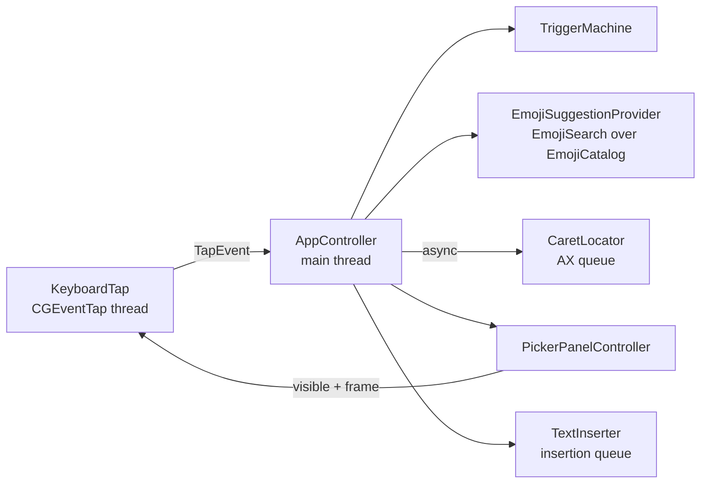

# Architecture

OpenReaction is a menu-bar app that watches typing system-wide, recognizes `:shortcode` tokens, shows a picker at the caret, and replaces the token with an emoji.

`OpenReactionCore` holds everything that can be tested without a window server: the trigger state machine, catalog and search, panel placement, preferences, permission flow. `OpenReaction` is the AppKit/SwiftUI shell.

## 1. Keystroke capture — `KeyboardTap`

**Active, session-level `CGEventTap`.** A listen-only tap (or `NSEvent` global monitor) can observe keys but cannot remove them. While the picker is open, arrows, Return, Tab and Esc must not reach the host app, so the tap is created with `.defaultTap` and returns `nil` for those events. A swallowed press stays *owned* until its key-up: repeats and the release are swallowed too, so the host never sees an orphaned key-up or a stray repeat after the picker closed. Only unmodified keys count; ⌘, ⌃ and ⌥ chords belong to the host and reset typing.

**Text is decoded only when it may be.** The tap reads typed characters (`CGEventKeyboardGetUnicodeString`) only while `capturesText` is on, which the controller sets from the focus state below. In a password field or an unknown field, keystrokes pass through without being decoded at all.

**The callback stays trivial.** macOS disables a tap whose callback is slow (`tapDisabledByTimeout`). The callback runs on a dedicated thread with its own run loop, reads key code, flags and typed characters, checks a lock-protected `pickerVisible` flag, and posts a `TapEvent` to the main queue. Matching, Accessibility calls and UI never run there. When macOS disables the tap anyway (timeout or `tapDisabledByUserInput`), the callback re-enables it and sends a reset, since keystrokes may have been missed.

There is a small race: the main thread updates `pickerVisible` asynchronously. A swallowed key is acted on only if the picker is still open; otherwise the controller reposts it so no keystroke is lost. Conversely, a picker key that already passed through to the host is never acted on, even if the picker opened a moment later.

Events OpenReaction posts itself carry a tag in `eventSourceUserData`, and the tap passes them through untouched.

**Replacement transactions.** Deleting the token and typing the emoji takes several events, and the user may keep typing meanwhile. From `beginHold` until a *flush* marker posted after the last synthetic event reaches the tap, physical keyboard events are held and then replayed in order (repeating if more arrived during the replay). Typing during a replacement lands after the emoji, never between the deletes. A 1 s deadline releases the hold if the flush never arrives.

## 2. Trigger state machine — `TriggerMachine`

The machine never sees the host's text. It mirrors a short tail of typed characters (64) and derives the active token from that tail after every input:

- A token is `:` followed by up to 30 shortcode characters (`a–z 0–9 _ + -`).
- The colon must follow a boundary: start of known text, whitespace, punctuation such as `(` or quotes, or an emoji. Letters, digits and URL/time punctuation (`: / \ . _ - + @ # & = ? % ~ $`) glue it to a word, so `http://`, `12:30` and `key:value` never trigger.
- Backspace pops the tail; re-deriving handles editing inside the query and backing over the colon.
- A closing `:` after a non-empty query reports `completedShortcode`; the controller replaces `:query:` if it is an exact shortcode.
- Esc dismisses the current token only; a new colon starts fresh.
- Anything that may move the caret without typing — click, app switch, arrows, Home/End, ⌘/⌃ shortcuts, Return/Tab when the picker is closed — resets the tail to "unknown", which counts as a boundary.

The picker opens once the query has two characters and at least one result.

### Coordinator and safety rules — `TypingCoordinator`

Every keystroke decision is made by a pure, tested coordinator that returns effects for the app layer to run:

- **Focus gate.** Text is captured only while the focused element is known to be editable. `FocusMonitor` watches the frontmost app with an `AXObserver` (focused-element and window changes) and app activation; each change marks focus unknown and re-probes it. Unknown, unavailable (timeout, no focus, no Accessibility) and secure focus capture nothing, and moving focus forgets whatever was typed.
- **Per-token check.** At the colon the focused element is probed again for the caret position; insertion and the picker need that answer to be editable. The answer names the target element.
- **Verified replacement.** Before deleting, the app confirms the same element (by `CFEqual` and pid) still has focus, is not secure, has no selection, and — when the app exposes its text — that the characters before the caret are exactly the typed token. Any mismatch cancels the insertion.
- **Swallowed keys only.** Picker commands act only on keys the tap actually removed from the stream.
- **Secure input** (`IsSecureEventInputEnabled`) drops everything, including mid-token.

## 3. Emoji data and search — `AppleEmojiData`, `EmojiCatalog`, `EmojiSearch`

**The Mac is the source of truth.** At launch, `AppleEmojiData` reads `AppleName.strings` from `/System/Library/PrivateFrameworks/CoreEmoji.framework/Resources/<lproj>/` with `PropertyListSerialization`: the set of emoji macOS knows and their names in the user's language (nearest `.lproj` for the preferred languages, English as fallback). These are plain data files; no private API is linked or called, and nothing from them is copied into the repository. Tests use hand-written fixtures.

Every path is optional. Missing, unreadable or empty files fall back to English, then to the bundled gemoji list. Verified on macOS 26.5 only; layouts on 14 and 15 may differ, which the fallback covers.

The Character Viewer's search index (`SearchModel-*/term_index.plist`, `document_index.plist`) and `SearchEngineOverrideLists` are not used: they refer to emoji by numeric document id, and no public resource maps those ids to emoji strings. Keywords come from name words and gemoji tags instead.

**gemoji** (bundled, MIT) contributes Slack/GitHub shortcodes (`:+1:`, `:tada:`) and tags, only for emoji the Mac also lists. Emoji without a gemoji alias get a shortcode derived from the English name (`face_with_bags_under_eyes`).

**Render check.** An emoji newer than the installed Apple Color Emoji font would appear as a box. `EmojiRenderability` lays each candidate out with CoreText and keeps it only if it shapes to one run of one real glyph from Apple Color Emoji. That catches missing glyphs and ZWJ sequences that fall apart. Results are cached per OS build. If the font cannot be inspected, gemoji's `ios_version` is compared with the running macOS instead.

**Ranking.** Each emoji lands in its best tier; tiers never mix:

| Tier | Match |
| --- | --- |
| 0 | exact shortcode |
| 1 | shortcode prefix |
| 2 | word prefix in the name or a shortcode |
| 3 | exact keyword |
| 4 | keyword prefix |
| 5 | same English stem (`parties` → party) |
| 6 | fuzzy subsequence, 3+ characters, anchored at a word start, quality floor |
| 7 | one typo (Damerau-Levenshtein ≤ 1), 4+ characters |

Tiers 6 and 7 are fallbacks: they only fill in when tiers 0–5 found fewer than 4 emoji, a fuzzy match must start at a word start, and its fzy-style score must reach 70 of 100. Within a tier: frecency (use counts halving every 14 days), a small popularity prior, fuzzy quality (first, in the fuzzy tier), shorter text. Indexes are precomputed as byte arrays; a query over the full set stays well under 5 ms in release builds.

Frecency persists only the emoji, a decayed count and the day of last use — never the surrounding text — and Settings can clear it.

`Suggestion` and `SuggestionProvider` are deliberately not emoji-specific, so a GIF or sticker provider can plug into the same picker.

## 4. Caret position — `CaretLocator`

Accessibility calls are synchronous IPC into the target app and can hang, so they run on a private queue with `AXUIElementSetMessagingTimeout` (150 ms). The main thread awaits the result; the picker simply appears when it arrives.

1. System-wide element → `kAXFocusedUIElementAttribute`.
2. `kAXSelectedTextRangeAttribute` → `kAXBoundsForRangeParameterizedAttribute`. Many apps return nothing for an empty range, so the previous character's bounds are tried next.
3. The focused element's frame, if it is short enough to say something about the caret.
4. The mouse pointer.

The lookup happens once per token, when the colon is typed, so the picker stays anchored instead of chasing the caret. Accessibility uses top-left-origin coordinates; `PanelPlacement.appKitRect` converts them.

**Won't find the caret:** Electron and Chromium apps that don't expose text bounds unless their accessibility tree is forced on, most terminals (excluded by default anyway), games, remote desktops and VMs, Java/Qt apps with partial AX support, and canvas editors such as Figma or Google Docs. These fall back to the element frame or the pointer.

## 5. Picker — `PickerPanel`, `PickerView`

**Non-activating panel that never becomes key.** If the picker took focus, the host's text field would lose its caret and keystrokes would stop reaching it. The panel uses `.nonactivatingPanel`, refuses key and main status, floats at pop-up-menu level, and joins all Spaces and full-screen apps. Clicks on rows work through `acceptsFirstMouse` without activating OpenReaction.

The picker is a horizontal capsule of up to 8 emoji, sized close to a native text line: 26 pt cells, 4 pt padding (34 pt tall), 18 pt glyphs, a 12 pt IBM Plex Mono label, at most 340 pt wide, 6 pt below the caret. The selected emoji sits in an orchid-tinted capsule that widens to show its `:shortcode:` and slides between items; wider rows scroll so the selection stays visible with the next emoji peeking past a faded edge. Arrow keys in either axis move the selection, hover and clicks go through the same selection path, and VoiceOver announces the selected emoji's name.

`PillLayout` (pure, tested) computes cell widths, the scroll offset and a stable panel width sized for the longest label, so the panel never moves while the selection changes. `PanelPlacement.place` (pure, tested) puts it below the caret, flips above only when there is no room, and clamps to the visible frame of the display containing the caret.

On macOS 26 the pill is system Liquid Glass (`glassEffect`) and the selection is tinted interactive glass. Earlier systems use a behind-window popover material with a hairline rim and standard shadow. Reduce Transparency switches to an opaque surface, Increase Contrast strengthens edges and uses a solid selection, and Reduce Motion replaces the springs with a short fade.

## 6. Insertion — `TextInserter`

The typed token is removed with synthetic Delete presses, then the emoji is posted as a keyboard event carrying a Unicode string (`CGEventKeyboardSetUnicodeString`), in chunks that never split a grapheme.

**Why not the pasteboard:** pasting overwrites the user's clipboard, restoring it races the target app's asynchronous paste, clipboard managers record every emoji, and ⌘V is rebound or blocked in some apps. A Unicode key event goes through the app's normal typing path, so undo and field formatting behave as if the user typed it. GIFs will need the pasteboard, with explicit save and restore.

Known limitation: apps that read key codes instead of the Unicode string (some games, VMs, remote desktops) will see the virtual key used for the event.

## 7. Safety

- **Secure input.** If `IsSecureEventInputEnabled()` is on, OpenReaction does nothing. Password fields and apps like Terminal's Secure Keyboard Entry turn it on, and macOS then stops delivering keys to taps anyway.
- **Secure fields.** If the focused element's subrole is `AXSecureTextField`, the token is ignored. This covers web password fields that don't enable secure input. OpenReaction never observes or inserts into a password field.
- **Excluded apps.** Apps with their own shortcode pickers (Slack, Discord, Teams, Telegram…) and terminals (where `:` starts commands and Return must never be intercepted) are excluded by bundle id. The menu toggles the frontmost app; user changes are stored as differences from the default list.
- **Privacy.** Typed text lives only in the 64-character tail in memory, and only while the focused field is known to be editable. The only persisted data derived from use is the frecency list (emoji, count, day). Nothing is logged or sent; there is no network code.

## 8. Permissions

The tap needs **Input Monitoring**; reading the caret and posting events needs **Accessibility**. The tap starts only when both are granted and stops if either is revoked. macOS ties grants to the code signature: an ad-hoc signed rebuild counts as a new app, so sign with a stable identity during development.

macOS sends no notification when these switches change, so `PermissionMonitor` polls: every second while onboarding or the System Settings guide panel is visible, every 15 seconds otherwise, and immediately when OpenReaction becomes active. `PermissionFlow` (core, tested with an injected provider) turns those readings into a status per permission:

- **missing** or **requested** (System Settings was opened for it)
- **granted**
- **needsRelaunch**: both are granted but the tap still fails to start; macOS sometimes applies Input Monitoring only to a fresh process
- **stale**: granted earlier under a different code signature (after an update or re-sign), or still failing after a relaunch. Onboarding offers **Reset permission**, which runs `tccutil reset` for OpenReaction's own bundle id only and asks again.

OpenReaction is menu-bar only (`LSUIElement`, `.accessory`) and never shows a Dock icon. Opening the app again from Finder or Spotlight shows onboarding while setup is incomplete, otherwise Settings, so it stays reachable when the menu bar hides the status item.
